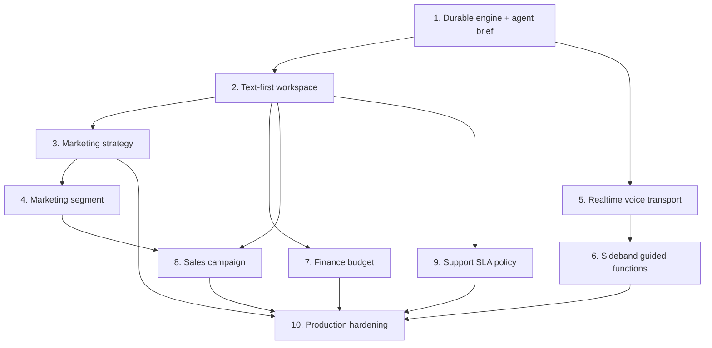

# Guided Dialogue and Voice Work Session Implementation Prompts

## How to use this prompt pack

Execute these prompts in order. Each prompt delivers a bounded production outcome and is written for a coding agent working in the current Virtual Company repository. Do not skip an earlier prerequisite unless repository inspection proves that its acceptance criteria are already satisfied.

The repository currently has a dirty worktree with extensive active Marketing and company-orchestration changes. Before every prompt, inspect `git status`, preserve all user changes, and adapt to the implementation that exists at execution time. Do not reset, discard, overwrite, or recreate overlapping work.

### Mandatory shared instructions for every prompt

Every prompt must be executed under all of the following requirements:

- Read and follow `AGENTS.md`.
- Read and follow `production-implementation.md`.
- Read and follow `docs/architecture-rules.MD` for all architecture-sensitive work.
- `architecture-inst.md` is referenced by workspace instructions but is absent as of 2026-08-12. If it exists when a prompt is executed, read and follow it. Do not invent its contents when it is absent.
- For UI work, read and follow `ui-instructions.md` and `docs/design.md`.
- For any new page, major component, modal, or significant redesign, complete the mandatory screenshot-first workflow before implementation: explicitly write the image prompt, generate the reference, store it in `docs/design/references/`, implement against it, and visually compare the running UI with the reference.
- Treat [`dialog.md`](dialog.md) as the capability design, but current repository implementation wins if it has evolved.
- Use the existing modular-monolith boundaries. Do not introduce a second orchestration stack, microservice, UI framework, or universal repository.
- Feature modules must not call an LLM provider directly. They use approved Application orchestration interfaces.
- Resolve and authorize company/user context server-side. A route or header company ID is never proof of access.
- Preserve explicit agent scopes, tool permissions, approval boundaries, audit, idempotency, and optimistic concurrency.
- Chat transcripts are not the system of record for business artifacts.
- No prompt may deliver only scaffolding, mock production data, an unconnected interface, or a plan. Implement the complete bounded behavior described by that prompt.
- Do not leave in-scope TODOs, placeholder success responses, silent catches, or unhandled intermediate states.
- Add tests to the narrowest appropriate projects and do not weaken valid existing tests.
- If a database change is needed, create and inspect an EF Core SQL Server migration through `VirtualCompany.Persistence.Migrations` using `VirtualCompany.Api` as startup, update the model snapshot, verify no pending model changes, and preserve both local SQL Server and Docker restore/migrate/run flows.
- Use safe, plain-English user-facing text. Do not expose storage enums, schema paths, policy types, provider payloads, hidden reasoning, or internal IDs.
- Before completing a prompt, inspect the final diff and report exact verification performed and any environmental verification that could not run.

---

## Prompt 1 — Deliver the durable guided-session engine through agent briefing

### 1. Title and outcome

Implement a production-ready shared guided work session backend, including persistence, authenticated APIs, schema-constrained checkpoint processing, review/commit boundaries, and a first end-to-end `agent_operating_brief` definition. The outcome is a real text-driven API workflow in which a user can collaboratively build, review, and explicitly commit an agent operating brief without bypassing the existing agent brief service.

### 2. Current context

- Direct conversations and messages already exist in `VirtualCompany.Domain/Entities/ChatEntities.cs`, `Application/Chat/DirectChatContracts.cs`, `Infrastructure.Operations/Companies/CompanyDirectChatService.cs`, `Api/Controllers/DirectChatController.cs`, and `Web/Pages/AgentChat.razor`.
- Direct chat is already routed through the shared single-agent engine by `DirectAgentChatOrchestrator`.
- Shared orchestration, runtime profile resolution, grounding, tool execution, style checks, audit, and structured results exist under `Application/Orchestration` and `Infrastructure.Operations/Companies`.
- Agent operating brief categories and commands exist in `Application/Agents/AgentBriefingContracts.cs`; updates are handled by the existing company agent service. The new definition must call that service rather than write agent profile data directly.
- `SharedAgentReasoningGateway` currently uses an OpenAI-compatible provider path for structured JSON reasoning. Reinspect it and other current provider abstractions before deciding whether to extend, refactor, or add a narrowly owned checkpoint adapter.
- There is currently no guided-session aggregate or API.

### 3. Dependencies

None.

### 4. Implementation requirements

- Add cohesive Domain entities/value semantics for a company-owned guided work session and its draft fields. Include explicit state transitions, stable artifact/schema identifiers, target artifact/version references, sequence/version concurrency, readiness counts, safe summary/next question, correlation, timestamps, and completion/cancellation state.
- Store important queryable state relationally. Use bounded JSON only for flexible field values and bounded source metadata. Continue using existing `Message` records for finalized transcript turns; link them through sanitized metadata without exposing hidden reasoning.
- Add precise Application commands, queries, DTOs, validation contracts, `IGuidedWorkSessionService`, `IGuidedArtifactDefinition`, and a shared checkpoint abstraction. Separate commands from queries.
- Implement the shared service in `VirtualCompany.Infrastructure.Operations`. Resolve artifact definitions through an intentional provider collection, enforce unique stable artifact types, and keep capability implementations outside Operations.
- Implement turn handling in the order defined by `dialog.md`: authorize, deduplicate, persist the user turn, load bounded context, request a schema-constrained checkpoint, deterministically validate proposed patches, apply them atomically, evaluate readiness, persist the safe agent reply, and audit.
- The checkpoint contract must return bounded patch operations, confirmations, assumptions, conflicts, missing fields, safe summary, next-question proposal, and readiness. Reject unknown paths, invalid enums/types, inaccessible evidence, unsupported classifications, and attempts to mutate authoritative artifacts.
- Never request, store, log, or return hidden chain of thought. Provider errors/refusals/invalid output must leave the session recoverable and must not advance the draft.
- Implement review preparation with an immutable preview/hash or equivalent confirmation token tied to company, session, session version, artifact type, target version, and proposed values.
- Implement confirm-commit with reauthorization, optimistic concurrency, stable business idempotency, preview revalidation, owning definition invocation, session artifact linkage, and business audit evidence.
- Implement `agent_operating_brief` as the first artifact definition. Use existing brief categories and `UpdateAgentBriefAsync`/equivalent current service path. Define real fields, labels, readiness, allowed evidence, review projection, and commit mapping. Confirmation updates only the selected agent's brief and must not alter autonomy, permissions, status, or unrelated profile settings.
- Add authenticated transport-only endpoints for start, list, get, turn, direct field correction, prepare review, confirm commit, and cancel. Use established company/user context and safe problem mappings.
- Register services in the owning module registrations. Do not re-register capability implementations in the root facade.
- Add EF configurations, DbSets, migration, indexes, company-scoped alternate/foreign keys, and concurrency consistent with current conventions.
- Add audit actions and technical logs/metrics sufficient to diagnose checkpoint, validation, duplicate, concurrency, and commit outcomes without leaking provider or transcript secrets.
- Document required configuration and safe disabled-provider behavior. No API key may be returned to clients.

### 5. Constraints and preservation rules

- Preserve all current direct-chat routes, message behavior, payload sanitization, and tests.
- A guided draft may change automatically; an agent operating profile may change only after explicit review confirmation.
- One session belongs to one company, creator, agent, conversation, and artifact definition.
- Cross-company conversation, agent, session, field, review, or commit references must be rejected without leaking existence.
- Direct field corrections must be schema-validated and recorded as user-confirmed with provenance.
- Retrying start, turn, review, or commit must not duplicate sessions, messages, patches, commits, or audit actions.
- Do not store provider schemas or provider-specific IDs as core domain semantics.
- Do not add startup DDL or rely on `EnsureCreated`.

### 6. Acceptance criteria

- Given an authorized user and active agent, when the user starts an `agent_operating_brief` session, then one company-owned resumable session linked to the correct direct conversation is created.
- Given a valid turn, when checkpoint output proposes valid changes, then the user and agent finalized messages and accepted field changes are persisted once with correct provenance.
- Given an unknown path, invalid value, inaccessible evidence reference, provider refusal, timeout, or invalid schema output, when a turn is processed, then no invalid patch is applied and the response exposes a safe recoverable state.
- Given the same client request ID, when a turn or commit is retried, then no duplicate message, patch, brief update, or audit event is created.
- Given incomplete required fields, when review is requested, then review is blocked or clearly marked incomplete with exact plain-English gaps.
- Given a valid review preview and explicit confirmation, when commit runs, then only the addressed agent's existing brief is updated through the owning service and the session becomes committed.
- Given a stale session or target version, when commit runs, then it fails safely and preserves a resumable session.
- Given another company or user, when any session operation is attempted, then the operation is denied and no data is disclosed or changed.

### 7. Verification

- Add Domain/application tests for transitions, classifications, patch validation, readiness, preview hashing, idempotency, and concurrency.
- Add API integration tests for full lifecycle, cross-tenant and cross-user isolation, inactive agents, invalid conversation ownership, provider failure modes, direct correction, retry behavior, commit, and audit.
- Add migration metadata/compatibility coverage where current test architecture supports it.
- Run the narrowest relevant Domain/Application/API test projects, the migration pending-model-change check, `dotnet build` for the API, and any existing dependency architecture tests affected by registrations.
- Verify local and Docker SQL Server migration/restore documentation or scripts remain compatible.

### 8. Definition of done

The prompt is complete only when a real authorized API client can conduct and commit an agent-brief guided session end to end; persistence and migration are production-ready; provider and concurrency failures are recoverable; tenant isolation, idempotency, audit, and tests are complete; and no part of this bounded slice is scaffolding, mock behavior, or an unconnected abstraction.

---

## Prompt 2 — Build the text-first guided work session workspace

### 1. Title and outcome

Build and visually verify the production Blazor guided-session workspace for the `agent_operating_brief` workflow. Users can start, resume, converse, inspect and correct the live draft, save for later, prepare review, confirm the brief update, or cancel, with accessible and responsive behavior.

### 2. Current context

- Prompt 1 provides the guided-session API and the first artifact definition.
- Existing direct chat is in `Web/Pages/AgentChat.razor` and `Web/Services/DirectChatApiClient.cs`.
- Agent management and brief editing exist in `Web/Pages/Agents.razor` and `Web/Services/AgentApiClient.cs`.
- The app uses typed capability clients registered through `AddVirtualCompanyApiClients` and company context through `ICompanyApiTransport`/`CompanyApiTransport`.
- `docs/design.md` requires screenshot-first work for this major component. The visual language is a calm executive control room with named agents, white cards, soft borders, blue actions, plain English, and visible next steps.

### 3. Dependencies

- Prompt 1 complete.

### 4. Implementation requirements

- Before editing UI, explicitly write an image-generation prompt based on `docs/design.md`, `ui-instructions.md`, the existing app shell, agent identity, a desktop split conversation/draft layout, responsive stacking, review state, missing/conflicting fields, error/empty states, and text composer.
- Generate and save `docs/design/references/guided-work-session-reference.png` or an equivalently descriptive approved filename. Do not ship it as UI content.
- Add a typed guided-session API client and view models using `ICompanyApiTransport`; preserve authentication, company/correlation headers, cancellation, safe errors, and endpoint ownership.
- Implement reusable components for session header/agent identity, conversation, live draft sections, field provenance/status, field correction, readiness summary, review diff, evidence, missing/conflicting information, and footer actions.
- Integrate entry points from the relevant agent brief/profile surface and ordinary direct chat without removing ordinary chat. The URL must be deep-linkable and resumable under current route conventions.
- Load a session by ID, restore messages and draft state, and show clear loading, empty, unavailable, concurrent-change, provider-failure, and commit-failure states.
- After a turn, show exactly which fields changed and why in plain English. Do not expose raw patch operations or schema paths.
- Direct field editing must use server-provided field metadata and validation; do not duplicate authoritative schema rules in Razor.
- Review must show proposed changes, assumptions, missing data, evidence, downstream meaning, and the distinction between “update brief” and approval/execution.
- Make confirmation explicit and version-bound. On a conflict, refresh review without discarding conversation state.
- Implement accessibility: labeled controls, keyboard order, focus movement after replies/errors, live regions for agent/status changes, reduced-motion behavior, and responsive stacked panels.
- Localize all new user-facing text consistently with the existing English/Swedish resource pattern and keep resource placeholder parity.
- Compare the running UI against the generated reference at desktop and mobile widths and refine layout, spacing, typography, cards, hierarchy, empty states, and responsive behavior.

### 5. Constraints and preservation rules

- Do not turn ordinary agent chat into a mandatory form workflow.
- Do not create a generic technical schema editor.
- The UI consumes server readiness and authorization; it does not reimplement them.
- Do not show provider/model names, internal statuses, schema paths, correlation IDs, or raw JSON.
- Preserve the current app information architecture; do not add a new primary-navigation destination solely for guided sessions.
- Do not use mock production data or optimistic success that the backend has not confirmed.

### 6. Acceptance criteria

- Given an agent profile, when the user chooses the guided briefing action, then a real session starts or resumes with the correct named agent and goal.
- Given a sent text turn, when the backend accepts it, then the conversation, changed fields, readiness, and next question update without a full application reset.
- Given a user correction, when saved, then the field displays as user-confirmed using the server response.
- Given an incomplete session, when the user saves for later and returns through its URL, then the same transcript and draft resume.
- Given a ready session, when review opens, then the user can inspect changes, assumptions, evidence, missing information, and downstream effect before confirming.
- Given a successful confirmation, when the brief is updated, then the UI links back to the updated agent profile and never labels the action as an approval.
- Given a provider error or concurrency conflict, when it occurs, then the user sees a safe actionable message and retains their working state.
- Given keyboard-only use or a narrow viewport, when the workflow is completed, then all actions and status information remain operable and understandable.

### 7. Verification

- Add Web client transport tests and component/presenter tests for lifecycle states, field labels, review mapping, errors, localization parity, and routing.
- Build `VirtualCompany.Web` and run the narrowest relevant Web tests and Web contract tests.
- Use the repository-approved local web verification flow. Reuse an existing repository host if available; otherwise start only through the safe documented process.
- Capture and inspect desktop and mobile screenshots and compare them with the reference; iterate until visually close.
- Verify no browser console errors, broken focus flow, or unhandled API failures.

### 8. Definition of done

The prompt is complete only when the agent-brief guided session is fully usable through the production UI, visually verified against its saved reference, accessible and responsive, integrated without breaking ordinary chat or agent settings, and backed exclusively by real authenticated APIs.

---

## Prompt 3 — Add the Marketing strategy workshop

### 1. Title and outcome

Implement a production Marketing strategy guided artifact definition and connect it to the guided-session workspace so Maya can collaboratively develop and explicitly commit a Marketing strategy draft covering target segments, positioning, Four Ps, competition, SWOT, Five Forces, evidence, and assumptions.

### 2. Current context

- Prompts 1–2 provide the shared backend and text UI.
- Marketing strategy contracts already include `MarketingStrategyDto`, save/update requests, grounded proposal/commit records, recommendations grouped into market/customer, STP/positioning, Four Ps, competitive analysis, SWOT/Five Forces, evidence, missing evidence, target segment version IDs, review status, and optimistic version.
- `MarketingStrategy` already enforces draft/rejected editability, review, approval, activation, cancellation, and version checks.
- `MarketingStrategyService` already provides list/get/create/update, proposal prepare/commit, submit, activate, cancel, segment, intelligence, and decomposition paths.
- `MarketingDashboard.razor` already has a Strategy tab and one-shot “prepare proposal/create draft” workflow. Preserve it unless an intentional integrated replacement demonstrably retains all behavior.
- The current worktree includes uncommitted Marketing files and migrations. Reinspect all current files and do not overwrite them.

### 3. Dependencies

- Prompt 1 complete.
- Prompt 2 complete for user-facing delivery.

### 4. Implementation requirements

- Implement `marketing_strategy` in `VirtualCompany.Infrastructure.Sales`, registered through `AddSalesInfrastructure`, using the shared Application definition interface.
- Define a versioned typed guided schema for strategy identity, validity, objectives, market/customer synthesis, approved target segment versions, positioning/differentiation, Product, Price, Place, Promotion, competitors, SWOT, Five Forces, risks, assumptions, evidence, and missing evidence.
- Load only company-scoped Marketing context permitted to Maya: current goals/objectives, accessible product facts, approved/active segment versions, reviewed/fresh intelligence, relevant prior strategy/campaign evidence, available channels, budget constraints, and policies. Preserve evidence IDs, classifications, freshness, and missing evidence.
- Do not infer approval or active status. Inaccessible, unreviewed, stale, or unsupported sources must be omitted or clearly classified, never silently promoted to fact.
- Implement deterministic field/path/type validation, segment-version eligibility, validity-period rules, readiness, conflict detection, and plain-English question metadata.
- Question selection should prioritize target decision, positioning, objectives, then material Four Ps and unresolved strategic risks. It should use existing records to avoid asking for known facts and mark recommendations as assumptions until confirmed.
- Prepare a Marketing-specific review projection that shows linked segment versions, section values, evidence, missing evidence, changes from an existing draft, and the fact that confirmation creates/updates a draft only.
- Commit through the current `IMarketingStrategyService` save/update or approved proposal-commit path. Preserve idempotency, expected version, segment links, evidence JSON, missing-evidence JSON, audit, and status. Do not use generic EF mutation.
- Add “Develop strategy with Maya” and resume-session entry points to the current Marketing Strategy surface. Reuse the guided workspace and agent identity; do not clone the engine inside the Marketing page.
- If the Marketing entry point or strategy-specific draft panel materially changes UI, update the screenshot prompt/reference workflow and visually verify it.
- Preserve the current one-shot proposal path or provide an intentional compatible path with equivalent API/UI/test coverage.

### 5. Constraints and preservation rules

- Only eligible Marketing agents with current capability access may own this definition.
- Segment IDs, strategy IDs, objectives, evidence, and target versions must be company-scoped and server-validated.
- Confirmation cannot submit, approve, activate, decompose, schedule, publish, or spend budget.
- Existing approval must still be required before activation.
- Do not redesign `SectionsJson` storage globally in this prompt; serialize the typed guided draft into the existing compatible representation.
- Preserve all active Marketing implementation and migrations in the dirty worktree.

### 6. Acceptance criteria

- Given Maya and available approved segments, when a strategy session starts, then the draft context lists only eligible same-company segment versions and grounded Marketing evidence.
- Given the user selects primary and secondary segments, when the turn is processed, then segment fields link to validated versions and display user-confirmed provenance.
- Given incomplete Product/Price/Place/Promotion decisions, when Maya chooses a next question, then it targets the highest-impact missing or assumed decision without repeating established facts.
- Given stale or unreviewed intelligence, when it is relevant, then it is excluded or visibly classified and cannot become a confirmed fact without review/user confirmation.
- Given review preparation, when the strategy is ready, then all sections, evidence, assumptions, gaps, linked segments, and draft-only effect are visible.
- Given explicit confirmation, when no target conflict exists, then the existing Marketing service creates or updates exactly one strategy draft with compatible sections, evidence, missing evidence, segment links, idempotency, and audit.
- Given a stale strategy version or cross-company reference, when commit is attempted, then it fails safely without losing the session.
- Given the existing one-shot proposal flow, when its tests run, then behavior remains valid.

### 7. Verification

- Add definition/unit tests for schema, paths, readiness, question priorities, classification, evidence filtering, and mapping.
- Add API integration tests for start/turn/review/commit, create and update, segment validation, cross-tenant isolation, stale versions, idempotency, audit, and approval preservation.
- Add Web tests for Marketing entry/resume, section presentation, review summary, and safe errors.
- Run relevant Marketing API tests, guided-session tests, Web tests, API/Web builds, and existing Marketing strategy/operating-loop tests.
- Perform browser verification of a complete Marketing session and inspect the created draft through the existing Strategy surface.

### 8. Definition of done

The prompt is complete only when Maya can conduct a real evidence-aware strategy workshop and explicit confirmation creates or updates a valid existing Marketing strategy draft through current domain services, without bypassing versioning, tenant isolation, evidence classifications, audit, or later approval.

---

## Prompt 4 — Add Marketing segment discovery as a separate guided outcome

### 1. Title and outcome

Implement a bounded `marketing_segment` guided session that helps Maya and the user define, evaluate, review, and explicitly commit a versioned customer-segment proposal using the repository's existing Marketing segment model and attractiveness policy.

### 2. Current context

- The shared guided engine and UI are available from Prompts 1–2.
- Marketing strategy support is available from Prompt 3.
- Current Marketing contracts and entities already support segments, versioned criteria, needs, behaviors, channels, pricing, size ranges/method, confidence, economics, scorecards, evidence, normalized dimensions, attractiveness scores, target decisions, approval, and impact analysis.
- `MarketingStrategyService` already prepares and commits segment proposals and versions. Preserve these services and current uncommitted Marketing work.

### 3. Dependencies

- Prompts 1–3 complete.

### 4. Implementation requirements

- Add a separate `marketing_segment` artifact definition in `VirtualCompany.Infrastructure.Sales`; do not expand `marketing_strategy` into a catch-all.
- Define fields for segment identity/description, criteria, needs, behaviors, channel presence, price sensitivity, size range/method, economics, evidence, score dimensions, confidence, risks, and target rationale.
- Use current Marketing intelligence, product fit, campaign/customer evidence, and existing segment versions as bounded company-scoped context.
- Apply existing deterministic score-dimension completeness and `SegmentAttractivenessPolicy`; do not allow the model to invent the computed attractiveness score.
- Require classifications and evidence for submitted/observed/estimated/inferred values. Missing authoritative size or economics evidence must remain visible.
- Prepare review with score breakdown, computed attractiveness, evidence quality, assumptions, differences from prior versions, and downstream impact warning.
- Commit through existing segment create/version or proposal-commit services with stable idempotency and correct company/segment lineage.
- Add start/resume entry points from the current Marketing Segments surface and allow a completed segment session to be selected later by the strategy workshop only after existing eligibility rules are satisfied.

### 5. Constraints and preservation rules

- Do not automatically mark a segment approved, active, or targeted.
- Do not overwrite an existing segment version; create a new version through existing semantics where applicable.
- All evidence and segment lineage must remain company-scoped.
- Score calculation is deterministic backend behavior, not an LLM output.
- Preserve current approval, target-state, impact, and concurrency behavior.

### 6. Acceptance criteria

- Given a new segment session, when evidence and user decisions are added, then the draft tracks complete provenance across all required dimensions.
- Given incomplete score dimensions, when review is requested, then the exact missing dimensions are shown and no fabricated attractiveness score is accepted.
- Given complete valid dimensions, when review is prepared, then the backend-computed score and evidence quality are displayed.
- Given explicit confirmation, when commit succeeds, then exactly one company-owned segment/version is created through the existing service with matching dimensions and idempotency.
- Given an existing segment, when a revision is confirmed, then a new version is created rather than silently overwriting history.
- Given cross-company evidence or segment lineage, when referenced, then it is rejected without disclosure.
- Given confirmation, then approval, activation, and target selection remain separate existing actions.

### 7. Verification

- Add focused tests for schema/readiness, score calculation integration, evidence classification, version mapping, and impact warnings.
- Add API tests for create/revise, retries, cross-company references, concurrency, and audit.
- Add Web tests for Segment entry/resume, score and evidence presentation, and transition back to Strategy.
- Run relevant Marketing segment, strategy, guided-session, API, Web, and build checks.
- Browser-test one new and one revised segment session.

### 8. Definition of done

The prompt is complete only when a user and Maya can collaboratively create a validated, evidence-aware, versioned segment draft through the real system, with deterministic scoring and unchanged approval/target boundaries.

---

## Prompt 5 — Add natural Realtime voice transport to guided sessions

### 1. Title and outcome

Implement production browser voice transport for guided sessions using the currently supported OpenAI Realtime WebRTC flow. Users can start, mute, interrupt, resume, and end a natural speech conversation with the addressed agent while the same durable guided-session state and text fallback remain authoritative.

### 2. Current context

- Prompts 1–4 provide durable text sessions and real artifact definitions.
- The current UI is Blazor Web App. Existing agent chat and the guided workspace are the integration surfaces.
- The backend stores permanent OpenAI credentials; clients must never receive them.
- OpenAI's current official guidance recommends WebRTC for browser speech-to-speech and supports either a unified `/v1/realtime/calls` server flow or ephemeral client secrets. Re-check official OpenAI documentation at implementation time and use a supported production flow.
- Realtime voice is a transport. It must not become a second transcript, draft, tool, or authorization system.

### 3. Dependencies

- Prompts 1–2 complete.
- At least one production artifact definition (Prompt 3 recommended) available for browser validation.

### 4. Implementation requirements

- Add Application contracts for starting/ending a voice binding and persisting deduplicated finalized voice events without leaking provider transport types into Domain.
- Implement the provider adapter and session initiation in `VirtualCompany.Infrastructure.Operations`. Validate company membership, conversation ownership, guided-session ownership/status, agent availability, and provider configuration before contacting OpenAI.
- Use a backend-owned permanent credential. If the unified SDP proxy flow is used, proxy the SDP and trusted session configuration through the backend. If ephemeral keys are used, return only the bounded ephemeral credential. Never return the permanent key.
- Include a stable privacy-preserving safety identifier generated by the backend.
- Bind a provider call to exactly one company, user, agent, conversation, and guided session. Do not allow the client to substitute private instructions, tools, target agent, or company context.
- Add a small purpose-built JavaScript module for `getUserMedia`, `RTCPeerConnection`, audio track/output, data channel, start, mute/unmute, interruption, bounded reconnect, end, and cleanup. Integrate it through Blazor JS interop.
- Expose user-visible states: connecting, listening, thinking, speaking, muted, reconnecting, ended, unavailable, and permission denied. Keep text input usable as the fallback.
- Persist only finalized user/agent transcript turns after server validation. Store sanitized metadata such as modality, provider item/event identity, interrupted/final state, bounded duration, and model/config version. Do not persist partial transcript deltas or raw audio.
- Deduplicate provider events and client retries. Reconnect must not replay accepted turns.
- Add configuration for enabled state, base URL, model, voice selection policy, timeouts, maximum session duration, reconnect count, and safe disabled behavior. Validate options on startup consistent with current configuration practices.
- Derive voice and conversational delivery from the agent communication profile or a versioned extension. Provide deterministic safe defaults for agents without voice settings.
- Extend the guided UI with accessible Start voice, Mute, End, AI disclosure, microphone status, and live finalized transcript behavior. Update/generate the reference screenshot if this materially changes the major component, then visually verify.
- End the active voice connection when the user changes agent/session, navigates away, loses authorization, commits/cancels, reaches duration limits, or closes the component.

### 5. Constraints and preservation rules

- Voice cannot commit fields or domain artifacts merely because the model says it did; finalized content must enter the same turn/checkpoint path.
- No business tools or side effects are added in this prompt; Prompt 6 owns server-side Realtime functions.
- Do not store raw audio by default.
- Do not expose API keys, private prompts, private tool schemas, provider payloads, or safety identifiers to logs/UI.
- Preserve text-only behavior and browsers without microphone/WebRTC support.
- One active voice session per user/guided session unless current product policy establishes a stricter limit.

### 6. Acceptance criteria

- Given an authorized guided session and configured provider, when the user starts voice, then a WebRTC session connects with the correct named agent without exposing the permanent API key.
- Given microphone permission denial or unsupported WebRTC, when voice starts, then the UI gives an actionable message and text remains fully usable.
- Given natural interruption, when the user speaks over the agent, then playback is interrupted and the finalized conversation remains ordered and deduplicated.
- Given a finalized voice turn, when accepted, then it passes through the same checkpoint/draft update flow and appears once in the transcript.
- Given partial deltas or repeated provider events, when received, then they are not persisted as duplicate messages.
- Given navigation, agent switch, cancellation, timeout, or component disposal, when it occurs, then tracks/connections are cleaned up and the session is left resumable.
- Given another company/user/session, when SDP or event operations are attempted, then they are denied without provider access or data disclosure.

### 7. Verification

- Add backend tests for authorization, provider configuration, SDP/session construction, secret handling, safety identifier behavior, event deduplication, session binding, timeouts, and failure mapping.
- Add JavaScript/component tests where supported for state mapping and cleanup, plus Web tests for controls, fallback, and localization.
- Run API/Web tests and builds.
- Perform browser verification with actual microphone permission: connect, speak, interrupt, mute, unmute, reconnect or simulate disconnect, end, and switch to text.
- Inspect browser network/log output to verify no permanent credential or private instruction leakage.
- Compare desktop/mobile UI to its reference and verify keyboard/screen-reader status behavior.

### 8. Definition of done

The prompt is complete only when natural browser voice reliably drives the same guided-session turns as text, credentials and private state remain server-side, finalized transcripts are deduplicated, interruptions and cleanup work, text fallback is complete, and authorization/failure tests pass.

---

## Prompt 6 — Add secure Realtime sideband functions and structured voice checkpoints

### 1. Title and outcome

Connect active Realtime voice sessions to Virtual Company's server-side guided-session controls so the spoken agent can read bounded draft/context, propose changes, and request review while every function call remains authorized, validated, audited, idempotent, and free of direct business side effects.

### 2. Current context

- Prompt 5 supplies WebRTC voice transport and finalized transcript ingestion.
- The guided engine already owns checkpoint validation and authoritative draft state.
- OpenAI Realtime supports application-owned function tools and server sideband control channels. Re-check current official documentation and SDK/protocol details at implementation time.
- Existing `IToolExecutor`, guardrails, responsibility policy, approvals, and audit remain authoritative. This prompt must not introduce an independent tool stack that bypasses them.

### 3. Dependencies

- Prompts 1 and 5 complete.

### 4. Implementation requirements

- Establish a backend sideband control connection for each active WebRTC session using the provider-supported call identity and authenticated server connection.
- Keep private session instructions, artifact schema summaries, and tool definitions on the server. The browser receives only UI-safe events.
- Expose only bounded guided-session functions: get current safe draft, list eligible artifact options, look up permitted evidence, propose a draft patch, mark a field unknown, and request review. Tool availability must be derived from artifact definition and agent permissions.
- Route reads and proposed patches through Application interfaces. Do not give the provider direct database, HTTP API, or domain-service access.
- Treat function arguments as untrusted. Validate JSON shape, company/session binding, call identity, field paths, value types, classifications, evidence references, expected version, and size limits.
- `propose_guided_draft_patch` creates a proposal processed by the same deterministic checkpoint/patch service. It cannot commit an artifact or promote an assumption to user-confirmed without explicit evidence of user confirmation.
- Return safe function outputs and continue the Realtime response only after application processing completes or returns a safe failure.
- Deduplicate calls by provider call ID plus company/session binding. Bound retries and do not replay successful mutations.
- Cancel sideband work when the voice session ends and prevent late events from modifying closed/committed/cancelled sessions.
- Persist business audit evidence for accepted/rejected function calls and technical telemetry for latency/failure without raw arguments containing sensitive transcript data.
- Ensure the final pre-review structured checkpoint uses the schema-capable text checkpoint provider, even if Realtime functions updated draft proposals during speech.

### 5. Constraints and preservation rules

- Do not expose execute tools, payments, outbound messaging, campaign publishing, activation, approval, or generic tool execution to Realtime in this prompt.
- Existing agent permissions and artifact definition context are mandatory; a model request cannot expand them.
- Browser-side function execution is not authoritative.
- No hidden reasoning or raw provider event dump may be persisted.
- Sideband failures must leave voice/text session recoverable and the draft consistent.

### 6. Acceptance criteria

- Given an active authorized voice session, when the model requests the current draft, then only UI-safe fields for that session are returned.
- Given an eligible evidence lookup, when called, then results are company/agent/artifact scoped and retain evidence classifications.
- Given a valid patch proposal, when processed, then deterministic validation applies it once and updates the same durable draft.
- Given invalid paths, inaccessible evidence, stale versions, oversized arguments, unknown functions, or cross-session call IDs, when called, then they are rejected safely and audited.
- Given a repeated provider call ID, when replayed, then no duplicate field change or message is created.
- Given a request to commit/approve/activate or execute an unavailable tool, when attempted, then it is denied and no side effect occurs.
- Given review requested by voice, when the session is ready, then the UI receives a review-ready signal but explicit user confirmation is still required.

### 7. Verification

- Add protocol/adapter tests for sideband binding, instructions, tool manifests, call validation, outputs, deduplication, cancellation, and late events.
- Add authorization and tenant-isolation tests for every function.
- Add end-to-end API/provider-fake tests for spoken patch proposal through durable draft and review request.
- Run guided, orchestration, API, and Web tests/builds.
- Browser-test a Marketing voice session that reads eligible segments, updates positioning, asks a follow-up, and opens review without committing.

### 8. Definition of done

The prompt is complete only when server-controlled Realtime functions can safely assist a guided voice session without bypassing shared orchestration, tenant/agent scope, deterministic patch validation, explicit review confirmation, audit, or existing side-effect policies.

---

## Prompt 7 — Add a Finance budget workshop

### 1. Title and outcome

Implement a Finance-owned guided budget workshop in which Laura and an authorized user develop, review, and explicitly create or update a Finance budget draft through existing Finance planning commands.

### 2. Current context

- The shared engine/UI and optional voice transport exist from earlier prompts.
- Finance budget commands, queries, DTOs, and service methods exist in `Application/Finance/Contracts/CoreContracts.cs` and `Infrastructure.Finance/Finance/CompanyFinanceCommandService.Planning.cs`.
- Finance reporting/forecast contracts and planning baselines exist and may provide bounded evidence.
- Finance policy, authorization, audit, and tenant boundaries must remain in Finance. Reinspect current contracts and pages before implementation.

### 3. Dependencies

- Prompts 1–2 complete.
- Prompts 5–6 are optional for text delivery and required only for voice parity.

### 4. Implementation requirements

- Add a `finance_budget` definition in `VirtualCompany.Infrastructure.Finance` and register it through `AddFinanceInfrastructure`.
- Define fields from current budget commands/entities, including name/period, categories or lines, amounts, currency, assumptions, baseline source, owner/context, and any existing concurrency/version fields. Do not invent a parallel budget model.
- Load only authorized Finance planning baselines, actuals, forecasts, company currency, and relevant policies. Classify calculated/observed/projected/user-confirmed values distinctly.
- Apply deterministic currency, period, amount, total, line/category, and version validation. Backend calculations own totals; the model cannot override them.
- Ask questions in Finance priority order: period/baseline, mandatory allocations, major assumptions, material variances, then optional refinements.
- Prepare review with line-level values, calculated totals, variance from baseline/current budget, assumptions, missing evidence, and downstream meaning.
- Commit through existing create/update budget commands with reauthorization, expected version, stable idempotency where supported/added consistently, and audit.
- Add Finance page and Laura chat entry/resume links using the shared guided workspace.

### 5. Constraints and preservation rules

- Confirmation creates/updates a budget draft/configuration only; it never approves spending, pays anything, posts accounting entries, or changes a forecast unless an existing explicit command says so.
- Finance calculations and eligibility stay deterministic in Finance.
- Cross-company accounts, baselines, forecasts, or budgets are rejected.
- Do not expose sensitive raw Finance data beyond the user's existing authorization.
- Preserve current planning endpoints and tests.

### 6. Acceptance criteria

- Given an authorized user, when a Finance budget session starts, then only eligible same-company baselines and Finance data are available.
- Given user inputs and observed values, when fields update, then provenance distinguishes confirmation, observation, projection, and assumption.
- Given invalid currency, periods, negative/unsupported amounts, or inconsistent totals, when proposed, then deterministic validation rejects them.
- Given review, when displayed, then calculated totals and material variances match backend calculations.
- Given explicit confirmation, when committed, then the existing Finance service creates/updates exactly one budget with correct version/audit and no payment or posting side effect.
- Given stale version or unauthorized/cross-company reference, when committed, then it fails safely and remains resumable.

### 7. Verification

- Add Finance-owned unit tests for mapping, validation, calculations, readiness, and review.
- Add API tests for lifecycle, authorization, tenant isolation, idempotency, version conflict, and audit.
- Add Web tests for Finance/Laura entry points and budget presentation.
- Run the narrowest Finance, guided-session, API, and Web tests/builds; browser-test create and update flows.

### 8. Definition of done

The prompt is complete only when an authorized user can collaboratively create or update a real Finance budget through Laura and existing Finance commands, with correct calculations, provenance, review, tenant isolation, concurrency, audit, and no unintended financial execution.

---

## Prompt 8 — Add a Sales campaign planning workshop

### 1. Title and outcome

Implement a Sales-owned guided campaign planning workshop in which Alex and the user develop a campaign configuration, audience/segment choices, offer, milestones, activities, timing, budget, and readiness, then explicitly commit through the existing campaign planning service.

### 2. Current context

- Shared guided sessions and UI are available.
- `Application/Sales/CampaignPlanningContracts.cs` defines campaign initiative configuration, objectives, offers, segments, activities, readiness, audience preview/snapshot, scheduling, performance, currency, and attribution evidence.
- `Infrastructure.Sales/Sales/CampaignPlanningService.cs` owns campaign planning behavior; outbound campaign delivery has separate services and approval/policy boundaries.
- Marketing strategy/segment artifacts may exist but Sales must consume them only through approved Application contracts or durable references, not by referencing Marketing implementation classes.

### 3. Dependencies

- Prompts 1–2 complete.
- Prompt 4 recommended when Marketing segment versions should be selectable.
- Prompts 5–6 optional for text delivery and required for voice parity.

### 4. Implementation requirements

- Add a `sales_campaign_plan` definition in `VirtualCompany.Infrastructure.Sales`, keeping it separate from Marketing definitions and outbound execution.
- Map the guided schema to current campaign planning contracts: objective, offer, audience/segment, exclusions/permissions, dates, milestones, activities/dependencies, owners, budget/currency, KPIs, and readiness requirements.
- Load company-scoped pipeline/customer evidence, permitted Marketing segment references, current campaign state, sales policies, communication permissions, and available agents/channels.
- Deterministically validate lifecycle state, dates, dependencies, ownership, currency/budget, audience permissions, segment eligibility, objective/KPI shape, and current campaign version.
- Use existing readiness evaluation. The model may explain gaps but cannot declare a campaign ready against backend results.
- Prepare review with proposed campaign changes, audience implications, offer, budget, schedule/dependencies, readiness gaps, permissions, and clear statement that commit does not launch or send.
- Commit through `ICampaignPlanningService` and current commands. Preserve current campaign versioning, audit, idempotency, and scheduling boundaries.
- Add entry/resume points from the current Sales campaign surface and Alex chat.

### 5. Constraints and preservation rules

- Confirmation must not start a campaign, send email, publish content, acquire contacts, schedule meetings, or incur provider spend.
- Outbound side effects remain behind existing approval, outbox, permission, and delivery services.
- Do not copy Marketing implementation logic into Sales; use contracts and validated references.
- Preserve current campaign APIs, audience permission rules, and tests.

### 6. Acceptance criteria

- Given an authorized Sales campaign, when a session starts, then only eligible same-company context and segment references are loaded.
- Given activities with invalid dates/dependencies or an ineligible owner, when proposed, then backend validation rejects them and explains the gap.
- Given audience permission restrictions, when the user requests a prohibited audience, then it is blocked and cannot become ready.
- Given review, when shown, then readiness matches the existing campaign readiness service and launch/send is explicitly excluded.
- Given explicit confirmation, when committed, then current campaign planning commands persist exactly one plan/update with audit and no outbound action.
- Given stale lifecycle/version or cross-company references, when committed, then it fails safely without state loss.

### 7. Verification

- Add Sales-owned tests for mapping, readiness, dependency validation, permissions, and context filtering.
- Add API lifecycle, tenant isolation, retry, version, audit, and no-side-effect tests.
- Add Web entry/resume and review presentation tests.
- Run Sales campaign, permission, guided, API, and Web tests/builds; browser-test a complete plan and confirm no delivery/outbox execution was requested.

### 8. Definition of done

The prompt is complete only when Alex can collaboratively produce a valid real campaign plan through existing Sales services while readiness, permissions, tenant/version boundaries, audit, and separation from outbound execution remain intact.

---

## Prompt 9 — Add a Support service-level policy workshop

### 1. Title and outcome

Implement a Support-owned guided service-level policy workshop in which Ben and an authorized user define or revise response/resolution expectations and escalation behavior, review the consequences, and explicitly save through the existing Support SLA policy service.

### 2. Current context

- Shared guided sessions and UI are available.
- `SupportSlaPolicyService` already owns list, upsert, deactivate, and deterministic policy resolution behavior, including positive duration rules, response-before-resolution ordering, risk thresholds, time basis, customer tier, priority/category, escalation recipient role, and audit.
- Support safety, refund, reply, mailbox, and outbound delivery have distinct policies and are out of scope for this artifact.

### 3. Dependencies

- Prompts 1–2 complete.
- Prompts 5–6 optional for text delivery and required for voice parity.

### 4. Implementation requirements

- Add a `support_sla_policy` definition in `VirtualCompany.Infrastructure.Support`, registered through `AddSupportInfrastructure`.
- Define schema fields that map exactly to the current SLA upsert request and current policy semantics.
- Load same-company existing policies, current Support case distributions/tiers/categories where authorized and useful, and relevant escalation roles without exposing individual case content unnecessarily.
- Reuse deterministic SLA validation and resolution. The model may recommend values and explain trade-offs but recommendations remain assumptions until confirmed.
- Ask questions in priority order: scope/category/priority/tier, response time, resolution time, risk threshold, time basis, escalation recipient, activation.
- Prepare review with current-vs-proposed values, estimated affected policy scope where safely available, assumptions, conflicts with existing policies, and operational implications.
- Commit only through `ISupportSlaPolicyService.UpsertAsync` or its current equivalent, preserving audit and authorization.
- Add entry/resume points from the Support settings/policy surface and Ben chat using the shared workspace.

### 5. Constraints and preservation rules

- Do not send replies, change cases, issue refunds, alter mailbox routing, or deactivate unrelated policies.
- Do not infer authorization from Support page visibility.
- Preserve deterministic fallback/default SLA behavior and existing resolution tests.
- Do not expose customer case content as prompt context unless the existing authorization and minimization policy explicitly permits it.

### 6. Acceptance criteria

- Given an authorized user, when a policy session starts, then only same-company policies and permitted aggregate context are loaded.
- Given response/resolution/risk values that violate current rules, when proposed, then deterministic validation rejects them.
- Given overlapping or conflicting policy scope, when review is prepared, then the conflict is visible and commit is blocked or handled by current authoritative policy semantics.
- Given a model recommendation, when not explicitly confirmed, then it remains an assumption.
- Given explicit confirmation, when committed, then exactly one SLA policy is created/updated through the existing service and audit is written.
- Given cross-company policy/role references or unauthorized user, when attempted, then no information is disclosed or changed.

### 7. Verification

- Add Support-owned unit tests for schema mapping, deterministic validation, readiness, recommendations, and context minimization.
- Add API tests for lifecycle, authorization, tenant isolation, conflicts, retry behavior, and audit.
- Add Web tests for Support/Ben entry points and plain-English review.
- Run Support SLA, guided, API, and Web tests/builds; browser-test create and update scenarios.

### 8. Definition of done

The prompt is complete only when Ben can guide an authorized user to a valid Support SLA policy saved through the current service, with deterministic timing rules, minimized context, explicit confirmation, tenant isolation, audit, and no unrelated Support side effect.

---

## Prompt 10 — Production hardening, evaluations, retention, and release readiness

### 1. Title and outcome

Harden the completed guided dialogue and voice capability for production operation with representative evaluations, observability, retention controls, migration/restore validation, accessibility and browser matrices, operator documentation, and release gates across all implemented artifact definitions.

### 2. Current context

- Earlier prompts provide the shared engine, UI, Marketing definitions, Realtime voice and functions, and selected Finance/Sales/Support definitions.
- Each slice already has bounded tests. This prompt verifies cross-slice behavior and closes production operational gaps; it must not become a substitute for missing implementation from earlier prompts.
- The repository already separates business audit from technical logs, uses dependency health checks, and has local/Docker SQL Server restore flows and module-specific tests.

### 3. Dependencies

- Prompts 1–9 complete for the artifacts intended for the release.

### 4. Implementation requirements

- Build a representative, deterministic evaluation corpus for each implemented artifact definition covering complete sessions, ambiguous answers, corrections, recommendations, contradictory evidence, stale evidence, missing information, malicious prompt content, provider refusal, invalid output, and version conflicts.
- Evaluate business outputs rather than chain of thought: field accuracy, unsupported-assumption rate, evidence validity, correction rate, readiness accuracy, domain validation pass rate, review acceptance, and commit correctness.
- Add fault-injection/integration coverage for provider timeout/rate limit/unavailable configuration, sideband disconnect, duplicate/late events, database transient failure, commit conflict, and application restart/resume.
- Add bounded technical metrics and dashboards/log queries for session counts/status, turn/checkpoint latency, validation failures, provider outcomes, voice connect/reconnect/interruption/duration, deduplicated events, commit conflicts/failures, and token/audio usage where returned.
- Verify business audits capture actor, action, target, outcome, rationale summary, data sources, correlation, timestamp, and safe before/after evidence for material operations.
- Implement or finalize configurable retention for guided sessions, finalized transcript metadata, checkpoint/provider telemetry, and optional audio. Raw audio remains disabled by default. Retention cleanup must be company-safe, bounded, idempotent, observable, and must not delete authoritative domain artifacts.
- Add dependency/health reporting for required provider configuration and distinguish disabled, degraded, and unavailable states without logging secrets.
- Review rate limits, maximum session/turn sizes, maximum fields/context, voice duration, reconnect count, and abuse resistance. Apply safe bounded defaults and actionable failures.
- Validate privacy and security: secret scanning, prompt/context minimization, no hidden reasoning, no permanent key in browser/network payloads, safety identifier privacy, tenant isolation, late-event rejection, and tool allowlists.
- Complete accessibility verification for keyboard, screen reader announcements, focus, contrast, reduced motion, microphone controls, and responsive behavior.
- Verify browser support and explicit fallback behavior for supported desktop/mobile browsers; do not claim unsupported mobile parity.
- Write/update operator and user documentation: configuration, provider setup, safe failure states, retention, monitoring, troubleshooting, rollout/rollback, feature flag, cost controls, and each artifact's commit/approval boundary.
- Add a controlled feature flag/rollout policy if not already present. Disabling the feature must preserve existing sessions and ordinary chat without data loss.
- Run and document local SQL Server and Docker SQL Server migration/restore/migrate/start compatibility. Do not modify restore flows only for one environment.

### 5. Constraints and preservation rules

- Do not weaken authorization, approval, validation, or tests to improve evaluation scores.
- Do not log prompts/transcripts/provider payloads wholesale.
- Do not create production synthetic business records during evaluation.
- Do not delete authoritative artifacts through retention cleanup.
- Do not report voice/model quality solely from subjective demos; use the defined measurable outcomes.
- Rollback must not require dropping the database or reversing immutable migration history.

### 6. Acceptance criteria

- Given every implemented artifact definition, when the evaluation suite runs, then valid sessions meet documented field/evidence/readiness/commit thresholds and failures identify the exact bounded regression.
- Given malicious or conflicting input, when processed, then unauthorized paths/evidence/tools are rejected and no authoritative artifact is changed.
- Given duplicate, late, disconnected, timed-out, or restarted voice/provider flows, when recovered, then transcript/draft state is consistent and no duplicate commit occurs.
- Given retention execution, when records expire, then only eligible guided/transient data is removed or minimized, authoritative artifacts remain, and tenant boundaries/audit are preserved.
- Given feature disablement or provider outage, when users open ordinary chat or existing sessions, then the application remains stable and explains available fallback behavior.
- Given local and Docker SQL Server environments, when restoring and applying migrations, then both reach the same compatible model without startup DDL or destructive recreation.
- Given supported accessibility/browser checks, when the full workflow is performed, then all essential text and voice actions remain operable or have explicit fallback.
- Given production monitoring, when a provider or commit failure occurs, then operators can identify the affected bounded session/correlation and safe reason without accessing secrets or hidden reasoning.

### 7. Verification

- Run all guided-session Domain/Application/API/Web tests plus affected Marketing, Finance, Sales, Support, orchestration, authorization, migration, and contract suites.
- Run API and Web builds, dependency architecture tests, localization parity tests, migration pending-model-change checks, and relevant static/secret analysis.
- Execute the evaluation corpus and save a concise result report with thresholds and known supported limits.
- Perform browser verification at desktop and mobile widths for text and voice, including permission denial, disconnect, interruption, resume, review, conflict, and commit.
- Perform documented local SQL Server and Docker SQL Server restore/migration/start checks.
- Inspect final diffs, configuration samples, runbooks, and health endpoints for secret leakage and correct module ownership.

### 8. Definition of done

The prompt is complete only when the guided dialogue and voice release has measurable quality gates, safe and observable failure/recovery behavior, bounded retention, verified tenant/security/approval boundaries, accessible verified UI, compatible local/Docker database paths, complete operator documentation, and no unresolved in-scope production TODO or mock behavior.

---

## Dependency summary

Prompts 7–9 are deliberately separate because Finance budgeting, Sales campaign planning, and Support service-level policy are unrelated authoritative outcomes with different domain rules and side-effect boundaries. They may be scheduled independently after the shared platform is complete, but each selected release slice must pass Prompt 10 before production rollout.
