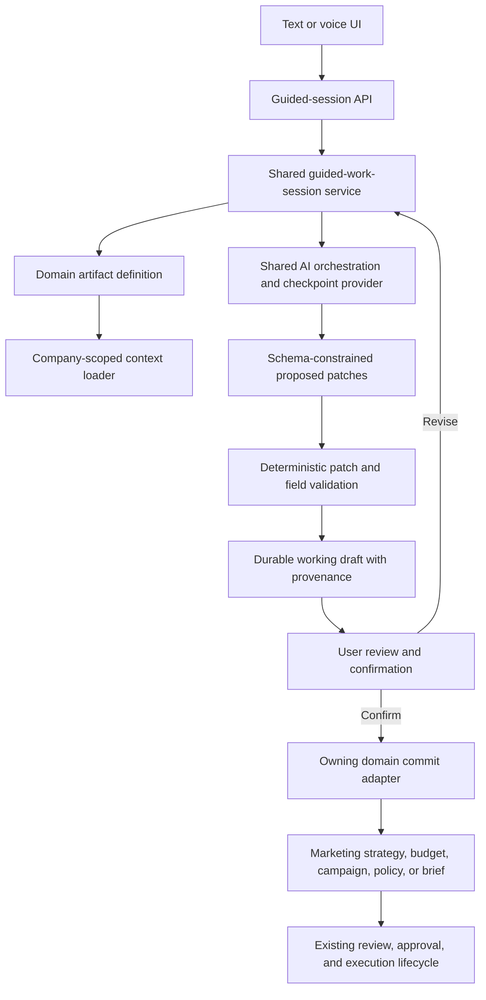
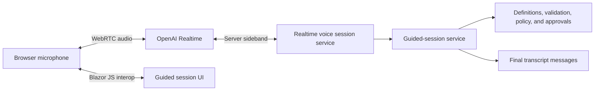

# Guided Dialogue and Voice Work Sessions

## Status and purpose

This document defines a reusable dialogue mode for Virtual Company in which a named agent and a user jointly develop a structured business artifact through text or natural voice conversation.

The first reference use case is a Marketing strategy workshop with Maya: the user and Maya discuss target segments, positioning, the Four Ps, competitive conditions, assumptions, and evidence; a live draft evolves during the discussion; and the user explicitly confirms the result before a Marketing strategy draft is created or updated.

The design is intentionally cross-agent. Finance, Sales, Support, Operations, and general agent briefing should use the same guided-session lifecycle while retaining their own domain schemas, validation, authorization, commit commands, and approval policies.

This is a design document, not an assertion that the feature is already implemented.

## Instruction and repository baseline

Implementation must follow:

- [`production-implementation.md`](production-implementation.md)
- [`docs/architecture-rules.MD`](docs/architecture-rules.MD)
- [`ui-instructions.md`](ui-instructions.md) for UI work
- [`docs/design.md`](docs/design.md) for UI work, including the mandatory screenshot-first workflow
- The repository-level `AGENTS.md`

`architecture-inst.md` is referenced by the workspace instructions but is not present in the repository as of 2026-08-12. If it is restored before implementation, it must be read and followed. Until then, `docs/architecture-rules.MD` is the available architecture authority.

Existing implementation wins over older plans. The worktree currently contains substantial uncommitted Marketing and company-orchestration work. Implementers must preserve it and re-inspect the repository before changing overlapping files.

## Product outcome

Dialogue mode should feel like a working session with a capable colleague, not a spoken form wizard and not a generic chatbot.

A successful session lets the user:

- Start a named, goal-specific workshop with the appropriate agent.
- Continue the same session using text or voice without losing state.
- See what the system already knows from accessible company records.
- Answer one useful question at a time and ask questions in return.
- Ask the agent to recommend an option when the user is uncertain.
- See a live structured draft beside the conversation.
- Distinguish confirmed facts, existing records, observations, inferences, assumptions, missing information, and conflicts.
- Correct a field directly or through conversation.
- Save an incomplete session and resume it later.
- Review a complete diff, evidence, assumptions, downstream effects, and approval requirements.
- Explicitly confirm creation or update of a domain draft.
- Continue through the domain's existing submission, approval, activation, and execution lifecycle.

The central product rule is:

> Conversation may update a guided-session draft automatically. It may not silently update an authoritative business record.

## Current repository fit

The proposed design extends current production boundaries instead of introducing a second agent stack.

### Direct conversation

- [`src/VirtualCompany.Web/Pages/AgentChat.razor`](src/VirtualCompany.Web/Pages/AgentChat.razor) owns the existing direct-agent conversation UI.
- [`src/VirtualCompany.Api/Controllers/DirectChatController.cs`](src/VirtualCompany.Api/Controllers/DirectChatController.cs) exposes direct-conversation and message endpoints.
- [`src/VirtualCompany.Infrastructure.Operations/Companies/CompanyDirectChatService.cs`](src/VirtualCompany.Infrastructure.Operations/Companies/CompanyDirectChatService.cs) verifies membership and conversation access, persists messages, and routes replies through `IDirectAgentChatOrchestrator`.
- `DirectAgentChatOrchestrator` is a compatibility facade over the shared single-agent engine.
- [`src/VirtualCompany.Infrastructure.Operations/Companies/SingleAgentOrchestrationService.cs`](src/VirtualCompany.Infrastructure.Operations/Companies/SingleAgentOrchestrationService.cs) already resolves agent configuration, grounding, permissions, tools, style, approval state, structured results, and audit evidence.
- [`tests/VirtualCompany.Api.Tests/DirectChatIntegrationTests.cs`](tests/VirtualCompany.Api.Tests/DirectChatIntegrationTests.cs) already covers persistence, tenant scope, idempotent sends, payload sanitization, and paging behavior that must remain intact.

### Marketing

- [`src/VirtualCompany.Application/Marketing/MarketingStrategyContracts.cs`](src/VirtualCompany.Application/Marketing/MarketingStrategyContracts.cs) already defines strategy, segment, intelligence, proposal, commit, decomposition, evidence, review, and version contracts.
- [`src/VirtualCompany.Domain/Entities/MarketingStrategyEntities.cs`](src/VirtualCompany.Domain/Entities/MarketingStrategyEntities.cs) already provides strategy draft, review, approval, activation, cancellation, and optimistic-version behavior.
- [`src/VirtualCompany.Infrastructure.Sales/Marketing/MarketingStrategyService.cs`](src/VirtualCompany.Infrastructure.Sales/Marketing/MarketingStrategyService.cs) already prepares and commits grounded Marketing strategy and segment proposals.
- [`src/VirtualCompany.Web/Pages/Marketing/MarketingDashboard.razor`](src/VirtualCompany.Web/Pages/Marketing/MarketingDashboard.razor) already contains a substantial Marketing workspace with Strategy and Segment surfaces.

Dialogue mode must extend these proposal and command paths. It must not replace them with generic JSON writes or recreate Marketing strategy functionality in Operations.

### Other reusable artifact targets

Real extension targets already exist:

- Finance budget commands and DTOs in [`src/VirtualCompany.Application/Finance/Contracts/CoreContracts.cs`](src/VirtualCompany.Application/Finance/Contracts/CoreContracts.cs), implemented in `CompanyFinanceCommandService.Planning.cs`.
- Sales campaign configuration, segments, activities, readiness, and scheduling in [`src/VirtualCompany.Application/Sales/CampaignPlanningContracts.cs`](src/VirtualCompany.Application/Sales/CampaignPlanningContracts.cs).
- Support SLA policy contracts and `SupportSlaPolicyService` in the Support capability.
- Agent operating brief contracts in [`src/VirtualCompany.Application/Agents/AgentBriefingContracts.cs`](src/VirtualCompany.Application/Agents/AgentBriefingContracts.cs), with persistence through the existing agent service.

## Experience example: Marketing strategy workshop

The user chooses **Develop strategy with Maya** from the Marketing Strategy surface or starts the same session from Maya's chat.

Maya loads accessible, company-scoped context such as:

- Current company goals and Marketing objectives.
- Product and service facts.
- Approved or active customer-segment versions.
- Marketing intelligence and its freshness/review state.
- Existing strategy versions and campaign outcomes.
- Budget constraints, channel availability, and relevant policies.
- The selected agent's role, communication profile, scopes, and permissions.

Maya opens with a short understanding of what is already known and asks the highest-value unresolved question. For example:

> I found two approved customer segments. Should this strategy prioritize small professional firms, mid-market finance teams, or both?

After the user answers, the visible draft updates:

| Field | Current value | State |
|---|---|---|
| Primary segment | Small professional firms | User confirmed |
| Secondary segment | Mid-market finance teams | User confirmed |
| Positioning | Less administration | User confirmed |
| Supporting value | Faster financial visibility | User confirmed |
| Pricing strategy | Not decided | Missing |
| Distribution | Direct digital sales | Existing evidence |
| Promotion | Not decided | Needs discussion |

Maya normally asks one question at a time. The user can also say:

- “I don't know—recommend something.”
- “Use what we did last year.”
- “Skip this for now.”
- “Show me the current draft.”
- “Why are you asking this?”
- “Change the primary segment.”
- “Let's finish this later.”

When enough information is available, Maya offers a review rather than committing automatically. Confirmation creates or updates a Marketing strategy in `draft` status. Submission, approval, and activation remain separate existing actions.

## Experience states

A guided session has explicit user-visible states:

- **In progress**: the user and agent are still developing the draft.
- **Needs information**: a required decision or evidence source is missing.
- **Needs clarification**: answers or evidence conflict.
- **Ready to review**: required fields are sufficiently complete, but no domain record has been changed.
- **Changes requested**: the review was returned to the conversation.
- **Committed as draft**: the confirmed result was written through the owning domain command.
- **Cancelled**: the working session was intentionally discarded or closed.

Provider outages, schema failures, authorization failures, concurrency conflicts, and commit failures are failure details, not silent state transitions. They must be safe and operator-visible.

## Architecture



### Ownership

The shared capability should be split by the existing modular-monolith boundaries:

- `VirtualCompany.Domain`: guided-session aggregate, deterministic state transitions, field provenance values, and storage enums/constants.
- `VirtualCompany.Application`: commands, queries, DTOs, artifact-definition interfaces, patch/checkpoint contracts, policies, and orchestration interfaces.
- `VirtualCompany.Persistence`: EF configurations and DbSets.
- `VirtualCompany.Persistence.Migrations`: SQL Server migration and model snapshot.
- `VirtualCompany.Infrastructure.Operations`: the shared guided-session service, shared checkpoint provider integration, generic session context, audit, and orchestration coordination.
- Owning capability infrastructure project: artifact definitions, context loaders, validators, and commit adapters for Marketing, Finance, Sales, or Support.
- `VirtualCompany.Api`: authenticated transport-only endpoints.
- `VirtualCompany.Web`: typed API client, presenters/view models, guided-session components, text interaction, and WebRTC JavaScript interop.

Feature modules must not call OpenAI directly. They provide structured definitions and domain adapters to the shared orchestration interface.

### Core interfaces

Indicative application contracts are:

```csharp
public interface IGuidedWorkSessionService
{
    Task<GuidedSessionDto> StartAsync(StartGuidedSessionCommand command, CancellationToken ct);
    Task<GuidedTurnResultDto> AddTurnAsync(AddGuidedTurnCommand command, CancellationToken ct);
    Task<GuidedSessionDto> GetAsync(Guid companyId, Guid sessionId, CancellationToken ct);
    Task<GuidedSessionPageDto> ListAsync(GetGuidedSessionsQuery query, CancellationToken ct);
    Task<GuidedReviewPreviewDto> PrepareReviewAsync(PrepareGuidedReviewCommand command, CancellationToken ct);
    Task<GuidedCommitResultDto> ConfirmCommitAsync(ConfirmGuidedCommitCommand command, CancellationToken ct);
    Task<GuidedSessionDto> CancelAsync(CancelGuidedSessionCommand command, CancellationToken ct);
}

public interface IGuidedArtifactDefinition
{
    string ArtifactType { get; }
    string SchemaVersion { get; }
    Task<GuidedArtifactContext> LoadContextAsync(GuidedArtifactContextRequest request, CancellationToken ct);
    GuidedPatchValidationResult ValidatePatch(GuidedPatchValidationRequest request);
    GuidedReadinessResult EvaluateReadiness(GuidedDraftSnapshot draft);
    Task<GuidedReviewPreview> PrepareCommitAsync(GuidedCommitPreparationRequest request, CancellationToken ct);
    Task<GuidedArtifactCommitResult> CommitAsync(GuidedArtifactCommitRequest request, CancellationToken ct);
}
```

`IGuidedArtifactDefinition` is a real capability boundary. Implementations are registered as a provider collection and resolved by stable artifact type. A definition must never become a universal persistence manager.

### Durable aggregate

Core queryable state should be relational. Flexible draft values and bounded snapshots may use JSON.

`GuidedWorkSession` should include at least:

- `Id` and `CompanyId`.
- `ConversationId`, `AgentId`, and `CreatedByUserId`.
- Stable `ArtifactType` and `SchemaVersion`.
- Session status.
- Optional target artifact ID and expected target version.
- Current sequence/version for optimistic concurrency.
- Current safe summary and next-question text.
- Readiness counts for confirmed, assumed, missing, and conflicting fields.
- Correlation ID, created/updated timestamps, and completion timestamp.

`GuidedDraftField` should include at least:

- `Id`, `CompanyId`, `SessionId`, and unique field path within the session.
- Bounded JSON value and display summary.
- Classification and review state.
- Confidence where applicable.
- Source message IDs and evidence source references as bounded metadata.
- Field version and updated timestamp.

The existing `Message` entity remains the transcript store. Finalized dialogue turns link to a guided session through sanitized structured metadata. Partial transcript deltas and hidden reasoning are not persisted.

The exact schema must be validated against current EF conventions before implementation. All schema changes require an EF migration and equivalent local and Docker SQL Server restore/run compatibility.

### Field provenance

Every populated field carries an explicit classification:

- `user_confirmed`
- `existing_record`
- `observed`
- `inferred`
- `assumption`
- `missing`
- `conflicting`

Classification affects readiness. A required field populated only by an assumption does not become user-confirmed merely because the agent repeated it. Direct field edits and explicit conversational confirmations can promote eligible fields to `user_confirmed` with provenance to the confirming message or UI command.

Example:

```json
{
  "path": "fourPs.price.strategy",
  "value": "value_based",
  "classification": "user_confirmed",
  "confidence": 1.0,
  "sourceMessageIds": ["message-id"],
  "evidenceSourceIds": [],
  "updatedUtc": "2026-08-12T10:00:00Z"
}
```

### Turn processing

Each text or finalized voice turn follows one authoritative sequence:

1. Resolve and authorize company membership, conversation ownership, addressed agent, and session.
2. Enforce session status, expected version, client request ID, payload limits, and agent availability.
3. Persist or deduplicate the finalized user message.
4. Load the artifact definition and only the company/agent-scoped context it permits.
5. Build a bounded checkpoint request containing the artifact schema, current fields, relevant recent turns or summary, evidence, and session goal.
6. Ask the shared checkpoint provider for schema-constrained proposed patches, confirmations, conflicts, missing fields, readiness, safe summary, and a proposed next question.
7. Reject unknown field paths, invalid values, unsupported classifications, inaccessible evidence references, and unauthorized operations.
8. Apply accepted patches through deterministic backend logic with optimistic concurrency.
9. Run the artifact definition's readiness and domain validation.
10. Persist a safe agent reply and updated session state with audit evidence.
11. Return the new draft, field changes, readiness, and next question.

A provider failure must not corrupt the draft or create an authoritative artifact. Retrying the same client request must not duplicate turns or patches.

### Question selection policy

The model can propose a question, but backend context and readiness determine what is eligible to ask. The next question should prioritize:

1. Required conflicts that block review.
2. Required missing fields.
3. High-impact assumptions needing confirmation.
4. Stale or low-quality evidence that changes the outcome.
5. Optional refinements with material business value.

The agent normally asks one question at a time. It may group only tightly related fields. It should explain why a question matters when asked and offer a recommendation when the user does not know, clearly marking the recommendation as an assumption until confirmed.

### Review and commit

Preparing review must produce a server-generated preview containing:

- Proposed domain values.
- Changes from the target artifact, if editing.
- Confirmed fields, assumptions, conflicts, and missing information.
- Evidence and freshness/review status.
- Validation failures and warnings.
- Expected target version.
- Downstream effects.
- Whether later submission or execution requires approval.
- A bounded confirmation token tied to company, session, session version, artifact type, and preview hash.

Confirming commit must:

- Reauthorize membership and capability access.
- Recheck session and target versions.
- Rebuild or verify the preview hash.
- Require an idempotency key.
- Call the owning domain service through the artifact definition.
- Create or update only a draft unless the existing domain command explicitly defines another safe result.
- Persist the resulting artifact reference and business audit evidence.
- Never imply that draft confirmation is approval or activation.

For Marketing, the adapter constructs existing Marketing strategy save/commit contracts. It does not mutate `MarketingStrategy` or `SectionsJson` through generic EF code.

## Marketing strategy schema

The first production artifact definition should cover:

### Strategy identity

- Title.
- Validity period.
- Business context.
- Objectives and measurable outcomes.

### Market and customer

- Market definition.
- Customer problems and needs.
- Relevant market changes.
- Evidence, freshness, and unknowns.

### Segmentation, targeting, and positioning

- Candidate approved segment versions.
- Primary and secondary targets.
- Target rationale.
- Positioning statement.
- Differentiation.

### Four Ps

- Product: offer, packaging, priorities, and limitations.
- Price: pricing model, principles, level, sensitivity, and discount boundaries.
- Place: acquisition and distribution channels.
- Promotion: messages, channels, content, and campaign themes.

### Strategic assessment

- Competitors.
- SWOT.
- Five Forces.
- Risks, assumptions, missing evidence, and decision dependencies.

The adapter should serialize this typed guided schema into the current Marketing strategy representation while preserving existing proposal classifications, evidence references, missing evidence, linked segment versions, optimistic version, status, audit, and approval behavior. Converting all Marketing JSON storage to a new relational model is not required for the first delivery.

## Cross-agent definitions

The same session lifecycle can support:

| Agent/capability | Guided session | Authoritative result |
|---|---|---|
| Marketing | Strategy workshop | Marketing strategy draft |
| Marketing | Segment discovery | Versioned segment proposal/draft |
| Sales | Campaign planning | Campaign configuration and planning draft |
| Finance | Budget workshop | Finance budget draft |
| Support | Service-level workshop | Support SLA policy draft or reviewed configuration |
| Operations | Operating-plan workshop | Existing goal/initiative/work plan artifacts |
| Any agent | Role briefing | Updated agent operating brief |

Each definition supplies its own:

- Stable artifact type and schema version.
- Field schema and plain-English labels.
- Required and optional fields.
- Permitted context sources.
- Question guidance.
- Patch and readiness validation.
- Authorization and agent-capability requirements.
- Review projection and diff.
- Existing domain command used to commit.
- Approval and downstream-action explanation.

Definitions should be implemented in separate, bounded deliveries. Unrelated domain adapters should not be combined merely to reduce prompt count.

## OpenAI integration

### Two-stage model

Natural conversation and authoritative extraction are distinct responsibilities.

1. **Conversation stage**: text uses the shared text orchestration path; voice uses an OpenAI Realtime speech-to-speech session. This stage manages fluent questions, answers, interruptions, tone, and spoken output.
2. **Structured checkpoint stage**: after meaningful finalized turns and always before review, a schema-capable text model produces a JSON-schema-constrained checkpoint. Backend code validates and applies its proposed patches.

OpenAI Structured Outputs are intended to enforce a supplied JSON schema: [Structured model outputs](https://developers.openai.com/api/docs/guides/structured-outputs).

Realtime models support natural speech and function calling, but the current model documentation must be checked at implementation time for exact structured-output capability: [Voice agents](https://developers.openai.com/api/docs/guides/voice-agents) and [GPT-Realtime-2.1](https://developers.openai.com/api/docs/models/gpt-realtime-2.1).

The checkpoint response should contain only bounded business state such as:

```json
{
  "draftPatches": [],
  "confirmedFields": [],
  "assumptions": [],
  "conflicts": [],
  "missingFields": [],
  "safeSummary": "",
  "recommendedNextQuestion": {
    "fieldPaths": [],
    "question": "",
    "reason": ""
  },
  "readyForReview": false
}
```

Hidden chain of thought must never be requested, returned to clients, logged, or persisted.

### Safe tools

Dialogue and Realtime sessions may be given narrowly scoped functions such as:

- `get_guided_session`
- `get_guided_draft`
- `get_available_artifact_options`
- `lookup_guided_evidence`
- `propose_guided_draft_patch`
- `mark_guided_field_unknown`
- `request_guided_review`

Function calls are proposals or reads. Business mutations execute only through Virtual Company services after authorization, validation, policy, and approval checks. OpenAI recommends application-owned function tools when the application owns business logic and private access: [Realtime with tools](https://developers.openai.com/api/docs/guides/realtime-mcp).

## Voice architecture

Voice is a transport for the same guided session, not a separate source of truth.



For browser clients, OpenAI recommends WebRTC rather than WebSockets: [Realtime API with WebRTC](https://developers.openai.com/api/docs/guides/realtime-webrtc).

The application server creates the session using its permanent credential; the browser never receives that credential. A server-side sideband channel monitors the session, updates private instructions, handles function calls, and receives finalized events: [Webhooks and server-side controls](https://developers.openai.com/api/docs/guides/realtime-server-controls).

Initial voice requirements:

- One Realtime session is bound to one company, user, agent, conversation, and guided session.
- Starting a different agent ends or pauses the current voice session.
- Finalized user and agent turns are persisted; partial deltas are not.
- Provider event/item IDs provide deduplication.
- Interruption status is retained in safe message metadata.
- Raw audio is not retained by default.
- Text remains available before, during, and after voice use.
- Permission denial, unsupported browser, provider outage, and reconnect exhaustion have plain-English fallbacks.
- A stable privacy-preserving safety identifier is supplied by the trusted backend.
- The UI discloses that the user is speaking with an AI agent.

Agent voice selection, pace, formality, brevity, language, conversational manner, and pronunciation guidance should be derived from persisted agent communication configuration or an explicitly versioned extension to it. Named agents remain configuration over the shared engine.

## UI design

Dialogue mode should have two entry patterns:

- **Ordinary chat** for unstructured questions and task follow-up.
- **Guided work session** for a named artifact and goal.

The guided workspace should use a calm split layout on desktop:

```text
┌──────────────────────────────┬────────────────────────────────┐
│ Conversation                 │ Live working draft             │
│                              │                                │
│ Maya asks and explains       │ ✓ Target segments              │
│ User answers by text/voice   │ ✓ Positioning                  │
│                              │ ! Pricing assumption           │
│ Listening / Thinking /       │ ○ Promotion incomplete         │
│ Speaking status              │                                │
├──────────────────────────────┴────────────────────────────────┤
│ Save for later  Review draft  Continue discussion  Confirm   │
└───────────────────────────────────────────────────────────────┘
```

The UI must:

- Keep the named agent, role, and session goal visible.
- Use plain-English field and status labels.
- Show what changed after each turn without excessive animation.
- Let the user inspect provenance and evidence.
- Let the user directly correct permitted fields.
- Keep confirmation visually distinct from review and from later approval.
- Provide responsive stacked behavior on smaller screens.
- Preserve accessibility for keyboard, screen reader, focus management, reduced motion, and microphone controls.
- Avoid presenting internal schema paths, provider event names, model names, or storage statuses.

Before implementing this major UI, the implementer must write an explicit image-generation prompt, generate a reference screenshot, save it under `docs/design/references/` with a descriptive filename such as `guided-work-session-reference.png`, and visually verify the built UI against it.

## Security, privacy, and governance

- Every session, field, query, message, preview, and commit is company-scoped.
- Route and header company IDs are context inputs, not authorization.
- Conversation ownership and artifact capability access are rechecked server-side.
- Agent status, data scopes, permissions, and responsibility policy are enforced.
- Retrieved evidence is limited to accessible, processed, and permitted company sources.
- Provider prompts receive bounded relevant context, never unrestricted tenant history.
- The browser never receives permanent provider credentials or private tool instructions.
- Prompt text and transcript content are untrusted input to tool and patch processing.
- Unknown field paths and inaccessible evidence IDs are rejected.
- Sensitive actions retain existing approval and outbox boundaries.
- Confirmation of a working draft never counts as approval for payment, outbound communication, activation, or another external action.
- Logs and audit evidence contain safe summaries, not credentials, raw provider payloads, hidden reasoning, or unnecessary transcript content.
- Retention rules distinguish transcript messages, session fields, provider telemetry, and optional audio. Raw audio retention is off by default.

## Idempotency, concurrency, and recovery

- Starting an equivalent session can accept a client request ID to avoid duplicate sessions.
- Each turn has a client request ID and expected session version.
- Provider event IDs deduplicate finalized voice messages and function calls.
- Patch application is atomic for a session version.
- Commit uses a stable business idempotency key derived from company, artifact type, session, target, and preview version.
- Editing an existing artifact requires its expected domain version.
- A concurrency conflict leaves the session resumable and produces a refreshed review path.
- Provider timeout or invalid schema output does not advance the draft.
- Interrupted voice reconnects use bounded attempts and do not replay committed events.
- Commit failure leaves the session in a recoverable review state with a safe reason.

## Audit and observability

Business audit evidence should cover:

- Session started, resumed, cancelled, and committed.
- Field correction or confirmation when materially relevant.
- Review prepared and confirmation accepted or rejected.
- Artifact created or updated, including before/after evidence.
- Policy or authorization block.
- Any tool request that reaches application execution.

Technical telemetry should include bounded metrics for:

- Session and turn latency.
- Checkpoint latency and schema-validation failures.
- Readiness progression.
- Provider failures and rate limits.
- Voice connection, reconnect, interruption, and duration.
- Duplicate events suppressed.
- Commit conflicts and failures.
- Token and audio usage where the provider returns it.

Do not treat a model's self-reported confidence as operational quality. Evaluate field accuracy, unsupported assumptions, correction rate, review acceptance, and successful domain validation using representative test sessions.

## API direction

Exact routes should follow current controller conventions, but the capability needs transport operations equivalent to:

```text
POST   /api/companies/{companyId}/guided-sessions
GET    /api/companies/{companyId}/guided-sessions
GET    /api/companies/{companyId}/guided-sessions/{sessionId}
POST   /api/companies/{companyId}/guided-sessions/{sessionId}/turns
PATCH  /api/companies/{companyId}/guided-sessions/{sessionId}/fields/{fieldPath}
POST   /api/companies/{companyId}/guided-sessions/{sessionId}/review
POST   /api/companies/{companyId}/guided-sessions/{sessionId}/commit
POST   /api/companies/{companyId}/guided-sessions/{sessionId}/cancel
POST   /api/companies/{companyId}/guided-sessions/{sessionId}/voice/session
```

The field path may need to be carried in the request body rather than a route if escaping and route safety are poor. Controllers remain transport-only. The Web client must use `ICompanyApiTransport` and be registered through `AddVirtualCompanyApiClients`.

## Testing strategy

### Domain and application

- Session state transitions and invalid transitions.
- Field classification and confirmation behavior.
- Unknown paths, invalid values, conflict handling, and readiness.
- Patch idempotency and optimistic concurrency.
- Review token/hash validation and commit idempotency.

### API and integration

- Membership, conversation ownership, agent status, and artifact authorization.
- Cross-company read, write, turn, review, commit, and voice-session attempts.
- Message persistence and sanitized metadata.
- Provider success, timeout, refusal, invalid schema, rate limit, and unavailable configuration.
- Existing Marketing proposal, draft, approval, and activation behavior remains unchanged.
- Commit creates or updates the correct draft through the owning service.

### Persistence and migration

- SQL Server migration and model snapshot.
- Required alternate keys, company-scoped relationships, indexes, and concurrency.
- No pending model changes.
- Local SQL Server and Docker restore/migrate/run compatibility.

### Web

- Typed API transport, company and correlation headers, cancellation, and error mapping.
- Text turn, resume, direct field correction, review, confirm, cancel, and empty/failure states.
- Microphone permission, start, mute, end, reconnect, interruption, and text fallback.
- Responsive layout, keyboard flow, focus, and accessible status announcements.

### End-to-end scenarios

- Complete a Marketing strategy workshop and create a draft.
- Save an incomplete session and resume it through another modality.
- Correct an inferred field and verify provenance changes.
- Reject an inaccessible cross-company segment or evidence reference.
- Encounter a target-version conflict and recover without losing discussion state.
- Confirm a draft that still requires later approval and verify no activation occurs.

## Delivery sequence

The recommended implementation sequence is captured in [`dialog-prompts.md`](dialog-prompts.md). At a high level:

1. Deliver the durable shared guided-session engine through a real agent-brief use case.
2. Deliver the text-first guided-session workspace and review flow.
3. Add the Marketing strategy definition using existing strategy contracts.
4. Add Marketing segment discovery as its own bounded definition.
5. Add Realtime voice transport to the same session state.
6. Add secure sideband function handling and structured voice checkpoints.
7. Add Finance, Sales, and Support definitions in separate capability-owned deliveries.
8. Harden evaluation, observability, retention, migration compatibility, and release operations.

## Decisions and non-goals

### Decisions

- One shared guided-session engine; named agents and artifacts are configuration/definitions.
- One artifact definition per real domain boundary.
- Existing messages store finalized transcript turns.
- Durable session fields store working state and provenance.
- Voice and text share the same session.
- Natural conversation and schema-constrained extraction are separate stages.
- Backend validation applies proposed patches.
- Explicit review and confirmation precede domain commit.
- Domain commit produces a draft unless existing domain behavior says otherwise.

### Non-goals for the first release

- Replacing ordinary direct chat.
- Automatically activating strategies, sending campaigns, moving money, contacting customers, or approving work.
- Persisting raw audio by default.
- Letting the Realtime provider connect directly to the database or private application services.
- Building a universal JSON form or universal domain repository.
- Migrating every existing JSON field into a new relational schema.
- Automatic multi-agent meetings or silent handoffs.
- Mobile parity before the web workflow is verified.

## Definition of done for the overall capability

The overall capability is complete when a user can start, pause, resume, review, correct, and explicitly commit a guided work session through text and voice; the resulting artifact is created or updated through its existing domain service; every operation is tenant-safe, version-safe, idempotent, audited, and recoverable; the UI matches its approved reference; provider failures are safe and visible; and no in-scope implementation remains scaffolding, mock production behavior, silent failure, or deferred TODO.
