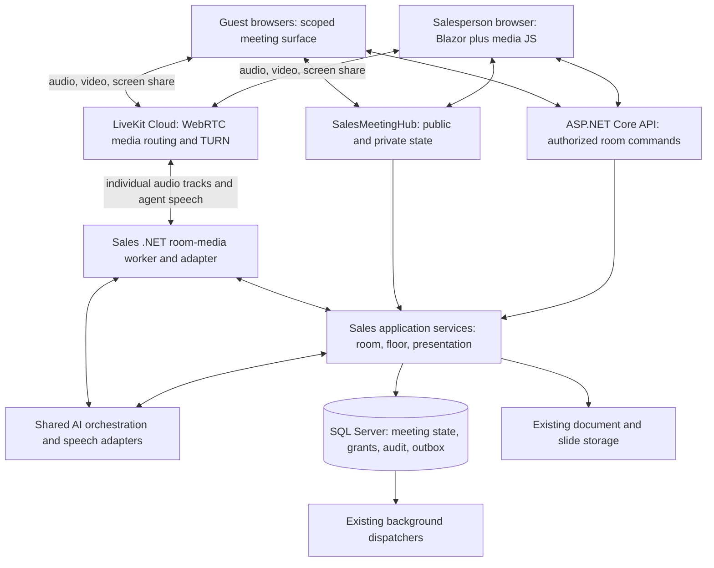

# Browser sales room: approach and architecture

Status: proposed architecture, 9 September 2026. This document designs the feature; it does not enable providers, deploy infrastructure, or establish production readiness.

Implementation sequence: [Browser sales room implementation prompts](browser-sales-room-implementation-prompts.md). Teams preservation is mandatory: [Teams preservation and future reactivation](teams-preservation-and-reactivation.md). Browser meetings are added alongside Teams; its implementation remains in the active tree for future reactivation.

## Decision

Build a browser meeting experience inside Virtual Company. A salesperson, invited customers, and the company's Sales agent join the same call. The agent can present an approved deck, hear participants, answer grounded questions, stop when interrupted, and yield to the salesperson.

Use **LiveKit Cloud as the initial media provider**, subject to the .NET media feasibility gate below. Keep Blazor, ASP.NET Core, SQL Server, and the shared AI orchestration subsystem. Use the LiveKit browser SDK through a small JavaScript interop module and a server-side .NET media participant. No new Python/Node agent application or microservice is proposed.

Render slides directly in each browser and synchronize authoritative presentation state through the existing SignalR hub. This gives readable slides and deterministic control without requiring an agent-controlled desktop or screen capture. Humans can additionally share a screen through WebRTC. Automated interactive product demos and animated agent avatars are later extensions.

Implementation must follow `/production-implementation.md`, `/docs/architecture-rules.md`, and `/docs/design.md`, plus applicable scoped `AGENTS.md` files. UI implementation requires the reference-image workflow in the design rules. This architecture document does not implement a UI.

## Customer and salesperson experience

1. From an existing lead/deal meeting workflow, the salesperson selects **Browser meeting**, chooses the Sales agent, uploads or selects a processed presentation, and reviews the customer-visible material.
2. Virtual Company creates a meeting-specific invitation link. Existing approval and delivery workflows handle calendar invitations and email. Copying a link is also supported; no Teams meeting creation is necessary.
3. Customers open the link, enter their display name, check microphone/camera/speaker operation, see the AI participation and capture notices, and wait for admission. A Virtual Company account is not required for guests.
4. The salesperson admits participants. The shared surface contains participant tiles, the presentation, captions when enabled, and call controls. The salesperson has a separate private workspace for notes, suggestions, grounding evidence, and controls.
5. The salesperson hands the floor to the agent: “Alex, please present the product.” Alex speaks while the approved slides advance. Questions pause narration. The salesperson can select **Take over** at any time.
6. Closing the meeting stops media and agent processing. Existing capture/closing services prepare minutes and proposed actions for review. Customer delivery and business changes follow their existing authorization, approval, and outbox paths.

Initial scope: one Sales agent, one organizer, and up to five additional humans; a 60-minute room limit, with agent duration and spend separately bounded by configured policy. These are proposed product limits, not provider limits. Start with English and Swedish pilot conversations, validated separately.

## What exists and what changes

The following components were inspected in the current working tree. Their presence is evidence for reuse, not a claim that every production path has been validated.

| Existing component | Reuse and required change |
| --- | --- |
| `SalesMeetingSession` and `SalesMeetingSessionService` | Keep meeting/customer/deal ownership and workflow. Add browser-room binding; verify creation no longer requires a Teams-specific identifier. |
| `SalesMeetingSchedulingService` | Keep calendar-provider and delivery boundaries. Separate conferencing selection from calendar selection; put our join URL into the event instead of requesting a provider online meeting. |
| `SalesPresentationDeckService`, processor, and renderers | Keep upload, processing, deck versions, and slide assets. Pilot must verify fidelity on real customer decks. |
| `SalesPresentationRuntimeService` | Keep versioned slide commands and manual/assisted/autonomous modes. |
| `SalesMeetingPresentationConductor` in `SalesPresentationConductor.cs` | Keep slide/render-before-narration coordination. Remove dependency on `TeamsPresenterOptions` for shared behavior and extend acknowledgements for multiple browser participants. |
| `SalesMeetingHub` | Keep authoritative public/private updates. Extend guest authorization; current stage access is not general meeting admission or organizer access. |
| `SalesMeetingRealtimeService` | Keep quotas, normalized events, tool policies, and receipts. Add a room-owned voice lifecycle; the current browser SDP start and per-user active-session check do not establish one agent per multi-user room. |
| `IRealtimeAgentPcmSessionGateway` | Reuse the shared server-side PCM boundary. Add the necessary controlled-turn and approved-speech contracts through shared orchestration. |
| `TeamsRealtimeAudioBridge` | Use as a reference for bidirectional audio and cancellation. Implement a separate browser-provider adapter; do not carry Teams binding or format assumptions into it. |
| `SalesMeetingQuestionAnsweringService` | Reuse authority resolution, company-scoped knowledge, and evidence. Add explicit customer-audience filtering and enforce the existing answer-release policy before speech. |
| Capture, closing, change proposals, and delivery dispatchers | Reuse meeting evidence and post-call workflows. Browser transcripts must identify their own provenance instead of claiming Graph provenance. |

Keep existing Teams routes working. Browser-room readiness must not depend on Teams registration, Graph application-hosted media, Teams SSO, a Teams manifest, or a Teams media-host certificate.

## Component architecture

Media goes directly through LiveKit; do not stream audio/video through Blazor circuits or SignalR. The API owns admission, policy, room lifecycle, and resource authorization. SignalR distributes authorized snapshots and updates; it is not the persistent system of record. LiveKit participant metadata is not evidence of tenant access or organizer authority.

### Ownership

| Project | Responsibility |
| --- | --- |
| Domain | Browser-room binding, participant/admission records, consent, room and floor state, invariants. |
| Application/Sales | Proposed `ISalesRoomService`, `ISalesRoomMediaAdapter`, `ISalesRoomFloorController` contracts and room DTOs. Keep files capability-specific. |
| Infrastructure.Sales | Room coordination, LiveKit adapter, background media session ownership, Sales-specific policy, presentation integration. Register in `AddSalesInfrastructure`. |
| Infrastructure.Operations | Shared AI reasoning/speech integrations behind Application contracts. No Sales-to-Operations implementation reference. |
| Infrastructure.Platform | Existing secrets, membership, audit, background execution, distributed infrastructure. |
| Persistence / Persistence.Migrations | EF mappings, indexes, SQL Server migrations and snapshot. |
| API / Web | Transport-only endpoints and hub authorization; Blazor pages, typed clients, bounded media JS interop. |

The media worker runs in the existing background execution model and creates scopes for database work. One durable lease with a fencing generation owns each active room's agent. Live audio buffers stay in memory; SQL stores lifecycle state and audit, not PCM frames.

### Provider feasibility gate

LiveKit's official Agents framework targets Python/Node, and its default linked-participant session behavior is not a ready-made multi-human meeting conductor. This proposal uses media transport with Virtual Company's orchestration instead. [Agents overview](https://docs.livekit.io/agents/), [participant management](https://docs.livekit.io/intro/basics/rooms-participants-tracks/participants/)

The community-maintained .NET repository provides separate server-management and realtime-media packages. The latter advertises server-side participation and audio/video publication/subscription. Pin and review a concrete release and native dependencies; do not assume the token-management package alone carries media. [Maintainer documentation](https://github.com/pabloFuente/livekit-server-sdk-dotnet)

Before committing the adapter, demonstrate on the intended Azure runtime: two human microphone tracks with stable identities, server-side PCM receive/send, one shared agent audio publication, interruption with buffer clearing, reconnect, removal, and a 60-minute soak. Validate native packaging, licensing, maintenance, and memory/resource cleanup. A failed gate requires a revised provider/adapter decision. Introducing another application stack requires an explicit architecture decision; it is not an automatic fallback.

## Room state and access

Proposed additive storage:

| Record | Important fields and constraints |
| --- | --- |
| `SalesBrowserRoom` | Company/session IDs, conferencing kind, opaque provider room reference, lifecycle state, expiry, version, agent generation, lease owner/expiry. Unique active browser-room binding per meeting. |
| `SalesRoomInvitationGrant` | Company/room IDs, hash of random invitation secret, expiry, redemption/revocation policy, optional intended attendee binding. Never store a usable secret in logs. |
| `SalesRoomParticipant` | Company/room IDs, server-issued participant ID, optional member/contact ID, display name, role, admission state, provider identity, disconnect/revocation state. Display names never grant authority. |
| `SalesRoomConsent` | Participant, purpose, notice version, granted/revoked timestamps. Separate AI processing, retained transcript, and any future recording choices. |
| `SalesRoomOperationReceipt` | Company/room, command or provider-event identity, generation, outcome and reconciliation state. Reuse existing receipt/outbox mechanisms where their semantics match. |

Extend existing transcript records with trustworthy participant/track provenance where needed. Continue using existing meeting, deck, question, minutes, and action entities. Keep queryable state relational and preserve stored status values. Add migrations only during implementation.

Room states: `Scheduled → Lobby → Live → Ending → Ended`, with explicit failed/reconciliation outcomes. Voice health is a separate state so an agent failure does not end the human call. Floor state records owner, control mode, turn generation, and current presentation version.

Invitation links are bearer capabilities and may be forwarded. Exchange a high-entropy, expiring link secret for a scoped guest session, remove it from the visible URL, and avoid referrer/analytics leakage. Admission is required before issuing short-lived room media tokens. Offer stronger invitee verification for restricted meetings; a typed email/name alone is not verified identity.

Guest permissions allow only the admitted room's public stage, permitted media, and questions. They never create company membership. Revalidate grants on commands, reconnect, asset access, and token renewal. Removal revokes application access and actively removes the provider participant; token expiry alone does not disconnect an existing stream. Fence old agent generations and revoke their provider access during replacement.

Proposed endpoints under a browser-room route family cover create/status, invitation redemption, lobby/admit/remove, media-token issue, consent, agent start/stop, takeover, question submission, and end-room. Organizer commands carry command IDs and expected versions. Guest endpoints resolve company/room from the validated grant, never a caller-supplied company header. Existing member services remain member-only; a guest question is mediated by a new authorized room use case with the guest preserved as the initiating actor.

## Multi-human dialogue and presentation

The room has **one agent conversation and one published agent voice track**. Do not create a separate conversational agent for each browser.

Subscribe to individual admitted human microphone tracks. Preserve participant identity, track generation, timestamps, and overlap metadata. Exclude the agent's output and screen-share/system audio from the agent's microphone input. Use echo cancellation and explicit device checks. For the first release, speaker-labelled streaming transcription feeds a room dialogue coordinator; extend shared speech contracts as needed. Do not mix everyone into anonymous PCM and assume the model can reliably identify speakers.

The floor controller makes the final speak/yield decision:

- **Manual (default):** salesperson drives slides and explicitly invokes an agent answer or presentation segment.
- **Assisted:** agent proposes actions privately; salesperson confirms customer-visible speech and slide changes.
- **Autonomous presentation:** organizer authorizes delivery of the selected approved deck and eligible answers. Human speech pauses narration; a question addressed to the agent can receive an answer once the floor is clear.

Human-to-human conversation does not automatically trigger a response. Address detection may suggest a turn; backend mode and floor policy authorize it. When speakers overlap, pause and wait or ask a short clarification. The salesperson wins concurrent floor claims. A **Take over** command increments the turn generation, cancels generation, flushes outbound audio, suppresses late tool results/frames, and pauses narration. Resume uses the latest accepted slide and talking-point marker.

For substantive spoken answers, use `SalesMeetingQuestionAnsweringService`, preserve evidence, and check customer-release policy before audio publication. Generate speech from released text through the shared speech boundary; extend that boundary rather than allowing unchecked model audio to stream first. Approved narration and small fixed conversational acknowledgements can take a faster path. This deliberate initial tradeoff improves control at the cost of some answer latency.

Customer-safe context includes the approved deck, approved public product material, and explicitly released deal information. Internal margins, negotiation limits, other customers' records, private notes, and raw reasoning never enter the public speech context. Prompts alone are insufficient: filter retrieval and output structurally, and authorize tools in backend code. Prices, discounts, contracts, emails, and CRM changes retain their existing policies; spoken requests cannot bypass them.

Slide commands carry deck/version, expected presentation version, command ID, and turn generation. The backend commits a valid command and publishes a customer-safe snapshot. Required audience clients acknowledge that exact revision before narration starts. At transition time, capture the admitted guest set; wait a bounded time for their acknowledgements. A slow/missing client produces a visible degraded state and pauses automatic narration, with explicit host override. New joiners receive the current snapshot and do not restart an existing turn. Reconnect restores authoritative state instead of replaying stale commands.

### Initial audio input policy: detect speech before AI processing

Decision: use speech detection for the initial browser release. Keep human-to-human call audio flowing normally through LiveKit. In the .NET media worker, run a lightweight local voice activity detector (VAD) on each consented human microphone track before forwarding audio to an external speech/AI provider. This local detector does not call an LLM. It saves external processing opportunities; it does not remove the Azure worker or LiveKit media cost.

Maintain an in-memory pre-roll buffer and a short trailing-silence allowance per track so word beginnings and natural pauses are preserved. Initial tuning candidates are 200–300 ms pre-roll and 500–800 ms trailing silence; validate them with real English/Swedish audio rather than treating them as fixed correctness thresholds. Bound utterance size and preserve timestamps, participant identity and overlap. Clear buffers on revocation, removal and session end; do not persist raw microphone audio.

Detect speech starts while cached or live narration is playing and immediately signal the existing floor/cancellation path. Do not wait for the end of the utterance or transcription before pausing the agent. Keep transcription/response decisions separate: speech detection does not prove that a person is addressing the agent. Preserve echo suppression, false-trigger handling, low-volume speech and background-noise tests. A detector failure produces an actionable paused/typed fallback, not an automatic switch to continuous billable processing.

Provider-side VAD after full audio transmission is not the intended upstream filter. Validate the selected speech API's segmented input, timestamp/context handling, silence and session billing. Sending fewer frames is not proof of a lower invoice: billable open-stream duration, minimums and reconnect overhead may still apply. Use a supported utterance-processing or streaming lifecycle behind shared speech contracts, and explicitly report any latency/quality tradeoff. Measure all of received audio duration, detected speech, forwarded audio and actual provider-billed usage.

This policy applies to the new browser-room route. Preserve Teams audio/VAD behavior unless a separately tested shared change is required.

## Privacy, lifecycle, and resilience

Apply existing pilot consent/retention requirements from `/docs/sales-meeting-realtime-voice-pilot.md`; this proposal does not enable that pilot. The initial product policy requires consent from all admitted humans before AI audio processing. A new joiner enters without AI subscription until consent is resolved; pause room AI while any admitted participant has not consented. Withdrawal stops AI subscriptions and agent output while humans can continue their call. Retained transcripts are separately controlled; raw audio/video recording is off in the first release.

Tenant isolation alone does not establish permission to disclose data to a customer. Enforce public/private projections on the server, including hub groups, slide URLs, captions, and errors. Audit customer-visible speech with released text/evidence references under the chosen retention policy. Keep raw media, tokens, SDP, provider payloads, and conversation text out of technical logs. Transport encryption does not imply that media is inaccessible to the provider or agent processor; residency and data-processing terms remain rollout decisions.

Use outbox/background execution for room provisioning/termination and reliable invitation/calendar/delivery writes. Persist intended provider operations with stable IDs, bound retries, and reconcile ambiguous results. Live media/control cannot wait on an outbox for every frame: cancellation takes effect immediately, while durable state/receipts and reconciliation protect lifecycle changes. Verify signed webhooks and deduplicate them; they are evidence, not the sole authority for admission.

If the AI provider fails, keep human media, manual slides, and typed questions available with a visible agent-unavailable state. If LiveKit fails, voice/video cannot continue: show reconnecting/failed, retain presentation state where the app remains reachable, and let the host end or retry. If the application control channel fails, stop agent output; human media may continue. If the organizer leaves, pause the agent; only a preauthorized co-host can resume, otherwise expire the room after a bounded grace period.

On worker failure, a new lease generation creates a fresh agent participant, terminates stale media sessions, restores approved context, and waits for explicit resume. Never replay abandoned speech. Deployments drain active sessions within a deadline; API restarts must not silently create duplicate agents. Production scale-out must replace process-local stage presence/acknowledgement assumptions with shared coordination or deliberately routed single ownership. SignalR scale-out alone does not make those dictionaries distributed.

## Delivery sequence and acceptance

These are architectural delivery milestones, not implementation prompts. Every implementation follows the canonical files referenced above and delivers real behavior.

| Stage | Dependencies and delivered behavior | Exit evidence |
| --- | --- | --- |
| 1. Media feasibility | Provider test credentials and chosen hosting runtime. Prove the .NET adapter with real participants. | Track identity, PCM output, interruption, reconnect and 60-minute soak results; documented SDK decision. |
| 2. Human browser room | Stage 1; additive room/grant schema. Ship guest admission, device checks, human audio/video, expiry and end-room from an existing meeting workflow. | Cross-tenant/guest authorization tests; real browser/network tests; calendar invite contains our URL without Teams creation. |
| 3. Shared presentation | Stage 2; existing deck processing/runtime. Ship public stage, private host controls, reconnect and render acknowledgements. | Two guests see the same committed slide; private notes never reach guest responses; stale commands cannot overwrite host changes. |
| 4. Agent participation | Stages 1–3; shared speech contract extensions and consent. Ship one agent, grounded speech, floor control and takeover. | Customer can interrupt, ask a grounded question, hear an eligible answer and resume; host override stops all obsolete speech; overlapping talk is handled. |
| 5. Capture and pilot hardening | Stage 4; approved rollout configuration. Ship consent-aware capture, reviewed minutes, existing delivery workflows and operational controls. | Crash/revocation/duplicate-webhook tests, spend limits, SQL Server migration evidence, load/soak tests, browser UAT and emergency-disable drill. |

Proposed pilot performance goals, to measure rather than promise: p95 admitted-room connection under 5 seconds on the agreed test network; p95 host-takeover command to silence under 300 ms; p95 end of an addressed question to first answer audio under 3 seconds for normal grounded questions; p95 slide synchronization under 500 ms excluding a failed client. Record actuals and tail failures; revise the architecture or product expectations if the gated speech path misses the agreed target.

Use the narrowest existing test projects: API tests for policy/room/media lifecycle, Web tests for Blazor behavior, and Web.Contract tests for wire boundaries. Verify fresh and upgrade migrations on SQL Server, cross-company reads/writes, expired/revoked guest access, private-data leakage, participant consent races, two simultaneous agent-start requests, late output after takeover, duplicate provider events, provider outage, and reconnect after deployment. Browser UAT covers current Chrome/Edge, Safari/iOS joining, microphone denial, autoplay unlocking, keyboard/captions, corporate-network TURN connectivity, and speaker/headset echo. Finish cross-layer implementation with API/Web builds and the applicable broader checks.

## Approved reusable narration

The initial implementation prepares and approves narration before the call, stores it as versioned slide/talking-point audio segments, and reuses those assets during eligible meetings. Live grounded answers are generated when needed. Both paths publish through the same room-owned agent voice track and obey consent, release policy, slide readiness, turn generations and interruption controls.

Cache keys include company, deck/content revision, approved script hash, language, voice, speech configuration and audience-specific context. Changes invalidate affected segments; customer-specific content cannot be reused for another audience. Store synthetic narration in approved object storage with relational manifests and approval references. It is not a recording of human participants. Preparation, validation, retry, partial readiness and revocation are visible workflow states. A missing or revoked asset pauses presentation unless policy explicitly authorizes an approved-text live fallback.

Prompt 6 implements generation/review/preview and Prompt 7 integrates room playback in `/docs/browser-sales-room-implementation-prompts.md`. Prompt 10 measures full 30-minute calls with 18 minutes of presentation, comparing cached, live-generated and separately live-composed narration. Follow `/docs/sales-narration-benchmark.md`; its short provider sample is not a measured full-call cost or Azure capacity result. Report generation/refresh, warm playback, live Q&A, listening, LiveKit and Azure costs separately.

## Hosting, cost, and remaining decisions

Start with managed LiveKit media and the existing Azure application/worker environment. Keep keys in existing server-side secret configuration. Validate the selected runtime's native SDK support and LiveKit connectivity before provisioning production capacity. Self-hosting an SFU/TURN system is a later operational decision, not needed for the initial product. LiveKit provides separate media and data primitives; the application can retain its own presentation authority. [Transport documentation](https://docs.livekit.io/transport/), [media/data documentation](https://docs.livekit.io/frontends/build/media-data/)

Track participant-minutes, agent processing time, transcription usage, speech output, model usage, storage and outbound traffic. Calculate cost per completed room from current contracted prices and measured pilot usage; do not invent a fixed per-call estimate. Set company concurrency, session duration, token/audio budgets and an emergency stop that terminates active agents as well as blocking new ones.

Before rollout, settle provider region/data terms, .NET SDK support ownership, the measured answer-latency target, and consent/retention wording. The initial implementation defaults are customer links with lobby admission, no recording, conservative agent autonomy, one organizer-controlled agent, and browser-native slide rendering. The first technical action is the .NET multi-participant media feasibility test; the first product increment is a human-only browser room integrated with the existing Sales meeting workflow.
