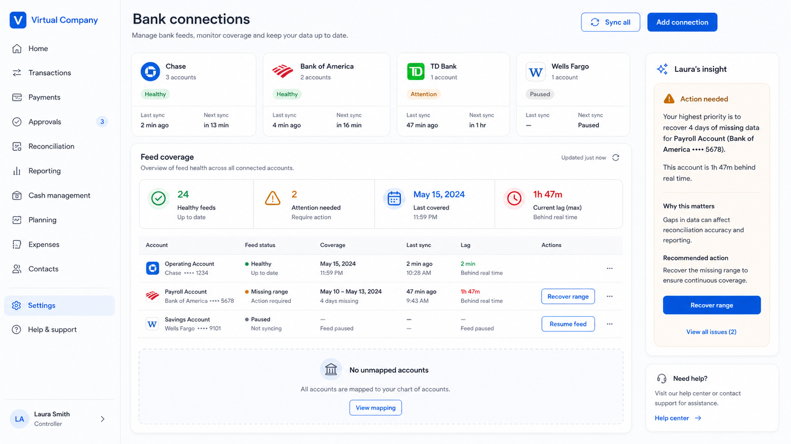

# Bank-feed operations reference

Generated with the repository `imagegen` workflow on 2026-08-28 and used as a visual reference for the bank-connections feed-health surface.

## Generation prompt

> Create a polished high-fidelity desktop SaaS screenshot for “Virtual Company”, a modern finance operations product. Show a Bank connections settings page at 1680×941 with a crisp white and very light gray canvas, navy typography, royal-blue primary actions, subtle borders, 12–16 px rounded cards, restrained green/amber/red status colors, and generous spacing. Use a fixed left navigation with the Virtual Company logo and finance sections, a main header titled “Bank connections” with “Sync all” and “Add connection” actions, four compact bank-connection summary cards, and a large “Feed coverage” operations card. The coverage card must show KPIs for healthy feeds, attention needed, last covered date, and maximum lag, followed by an account table with healthy, missing-range, and paused examples. Make missing coverage unmistakable with an amber status and a “Recover range” action. Include a right-side insight panel that explains the highest-priority missing range and recommends recovery. The overall composition should feel trustworthy, calm, enterprise-ready, and implementation-oriented. Use realistic but fictional data, readable English labels, no gradients, no glassmorphism, and no dark mode.

## Reference image

The implemented UI follows the repository design system and localization rules; the image guides hierarchy, health-state visibility, KPI grouping, and recovery-action prominence rather than providing literal production copy or bank branding.
