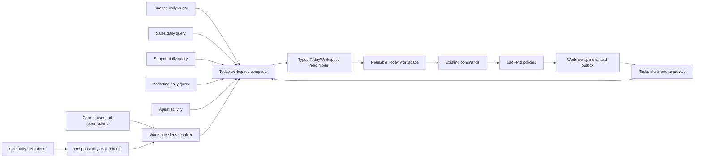

# Responsibility-Driven Workspaces

Status: Proposed

Implementation prompts: `/docs/responsibility-driven-workspaces-prompts.md`

## Purpose

Virtual Company should provide one reusable daily workspace whose content adapts
to the responsibilities of the current user. It should not require separate
dashboard implementations for an owner, Finance Manager, Sales Manager,
Marketing Manager, or Customer Support Manager.

Company size and job title supply onboarding defaults. The workspace shown at
runtime is determined by:

- the responsibilities assigned to the current user
- the data and actions the user is authorized to access
- the agents assigned to work for the user
- the approvals and escalations requiring the user's decision
- the issues and opportunities that currently have the highest business impact

This approach supports a micro-company owner who holds every responsibility and
continues to work when those responsibilities are distributed among managers as
the company grows.

Implementation must follow `/production-implementation.md`,
`/docs/architecture-rules.md`, and `/docs/design.md`. The mandatory reference
screenshot workflow in `/docs/design.md` applies before creating or
significantly redesigning the workspace UI.

## Design Principles

1. **One workspace, multiple responsibility lenses.** Keep the page structure
   stable and compose different content into it.
2. **Responsibilities are authoritative.** Job titles and company size create
   suggested assignments; they do not control the UI through hard-coded role or
   size branches.
3. **Actions before data.** The workspace prioritizes decisions, blocked work,
   risks, and recommendations over passive charts.
4. **Agents remain visible.** The user can see what assigned agents checked,
   completed, recommend, and are waiting for.
5. **The UI reads prepared state.** Opening the workspace must not synchronously
   invoke every agent or duplicate workflow logic.
6. **Authorization remains server-side.** Responsibility assignment affects
   relevance and composition, but never replaces company scoping, permissions,
   policy, or approval enforcement.
7. **Existing functional workspaces remain canonical.** The daily workspace is
   an executive and managerial entry point. Finance, Sales, Support, Marketing,
   Tasks, Work, and Approvals remain the detailed destinations.

## Responsibility Model

Introduce a first-class, company-scoped responsibility assignment model.

| Responsibility | Responsible person | Working agent | Example authority |
| --- | --- | --- | --- |
| Company performance | Owner/CEO | Company coordinator | Recommend and organize |
| Cash and accounting | Owner or Finance Manager | Finance agent | Prepare; payment approval remains human-controlled |
| Sales | Owner or Sales Manager | Sales agent | Operate internally within policy |
| Marketing | Owner or Marketing Manager | Marketing agent | Recommend; spending may require approval |
| Customer support | Owner or Support Manager | Support agent | Respond within policy; escalate exceptions |
| Compliance | Owner or Finance Manager | Finance agent | Prepare; filing and approval follow company policy |

A responsibility assignment should capture at least:

```text
CompanyResponsibilityAssignment
- CompanyId
- ResponsibilityArea
- ResponsibleUserId
- ResponsibleRoleId
- PrimaryAgentId
- AuthorityLevel
- ApprovalPolicyId
- EscalationUserId
- IsExecutiveOversight
```

Responsibility state is important queryable business state and should be stored
in relational columns rather than as opaque JSON dashboard configuration.

### Company setup presets

Presets simplify onboarding but are not permanent runtime rules.

#### Micro company

- All responsibility seats initially belong to the owner.
- Functional agents are assigned to Finance, Sales, Marketing, and Support.
- Sensitive execution remains subject to explicit company policy and approval.

#### Small company

- The owner retains company performance and executive oversight.
- Finance may be assigned to a Finance Manager.
- Sales, Marketing, and Support remain with the owner until explicitly delegated.

#### Medium company

- Finance, Sales, Marketing, and Support can be assigned to their managers.
- The owner retains company performance and executive oversight.
- Cross-functional issues can be escalated to the owner without exposing every
  operational task.

Users edit these assignments in Settings. Reassigning a responsibility changes
workspace composition without introducing or selecting a different dashboard.

## Daily Workspace Information Architecture

Use one canonical Today route, preferably the existing Overview destination,
with an optional responsibility lens. The page structure remains stable:

```text
+--------------------------------------------------------------+
| Today - Company                           Current local date   |
| Situation summary - decisions requiring attention            |
+--------------------------------------+-----------------------+
| Top priorities                       | Decisions             |
| 1. Highest-impact action             | Approvals             |
| 2. Time-sensitive action             | Confirmations         |
| 3. Blocked agent or workflow         | Escalations           |
+--------------------------------------+-----------------------+
| Performance snapshot                 | Agent briefing        |
| Up to four relevant metrics          | Checked               |
+--------------------------------------+ Completed             |
| Responsibility sections              | Recommended           |
| Finance, Sales, Support, Marketing   | Waiting for human     |
+--------------------------------------+-----------------------+
```

The stable workspace slots are:

1. **Situation summary**: a short explanation of what is happening now.
2. **Top priorities**: three to five ranked actions across relevant areas.
3. **Performance snapshot**: up to four metrics relevant to the active lens.
4. **Responsibility sections**: concise functional summaries with deep links to
   the canonical workspace.
5. **Decisions**: approvals, confirmations, and escalations requiring the user.
6. **Agent briefing**: what assigned agents checked, completed, recommend, or
   cannot continue without human input.

Every actionable item should explain:

- what happened
- why it matters
- who owns the responsibility
- which agent is working on it
- what the human needs to do
- when the information was last updated
- where to continue the detailed workflow

## Responsibility Lenses

The workspace can expose a lens picker when a user owns more than one useful
responsibility. A micro-company owner might see Company, Finance, Sales, and
Customers. A Sales Manager responsible only for Sales should not see a redundant
single-option picker.

| Workspace slot | Micro-company owner | Sales Manager | Finance Manager |
| --- | --- | --- | --- |
| Summary | Overall company health | Pipeline and forecast | Cash, close, and compliance |
| Priorities | Highest-impact items across all areas | Deals, leads, and sales decisions | Cash, invoices, bills, and accounting issues |
| Metrics | Cash, runway, pipeline, customer risk | Pipeline, forecast, conversion, deals at risk | Cash, overdue receivables, upcoming payables, close status |
| Main sections | Condensed Finance, Sales, and Support | Pipeline and prospect activity | Cash plan and finance attention queue |
| Decisions | All owner approvals | Discounts and sales exceptions | Payments and accounting exceptions |
| Agents | All assigned agents | Sales agents | Finance agents |

Executive oversight is distinct from operational responsibility. It allows an
owner to see material risks, cross-functional blockers, and required decisions
without receiving every task assigned to a manager.

## Application Architecture

The daily workspace is a composed query/read model. It is not a new
transactional subsystem and must not move domain decisions into Blazor.



### Feature-owned queries

Each feature owns its daily summary query and typed contract, for example:

```csharp
IFinanceTodayQuery
ISalesTodayQuery
ISupportTodayQuery
IMarketingTodayQuery
IAgentActivityTodayQuery
```

Application-level composition is handled through focused interfaces such as:

```csharp
ITodayWorkspaceQuery
IWorkspaceLensResolver
ITodayPriorityRanker
```

The composer resolves the current company and user, determines eligible lenses,
executes only relevant feature queries, ranks and deduplicates results, and
returns one typed read model.

### Typed read model

Prefer optional, strongly typed feature sections over arbitrary UI component
descriptions or database-stored card payloads.

```text
TodayWorkspaceReadModel
- Header
- SituationSummary
- Priorities
- Metrics
- FinanceSection?
- SalesSection?
- SupportSection?
- MarketingSection?
- Decisions
- AgentUpdates
- AvailableLenses
- GeneratedAt
```

This contract can evolve deliberately as new responsibility areas are added.
Presentation configuration must not become a generic policy or business-rules
engine.

### API

Expose the composed read model through a typed company-scoped endpoint, for
example:

```http
GET /api/companies/{companyId}/workspace/today?lens=company
```

The endpoint must:

- resolve the tenant and current user
- validate company access and permissions
- resolve responsibility assignments and executive oversight
- call only authorized feature queries
- rank and deduplicate priorities
- return safe explanations and canonical deep links

Actions continue through existing Finance, Sales, Support, Task, Approval, and
Company Operation commands. The workspace must not reimplement mutation,
eligibility, workflow, or approval behavior.

### Web composition

Use a single Blazor page and reusable presentation components:

```text
TodayWorkspace.razor
|- WorkspaceHeader
|- SituationSummary
|- PriorityStack
|- MetricStrip
|- FinanceTodaySection
|- SalesTodaySection
|- SupportTodaySection
|- MarketingTodaySection
|- DecisionRail
`- AgentActivityRail
```

Components receive typed view models. They do not independently infer
responsibilities, evaluate permissions, or assemble complex transactional data.

## Priority Selection

Content should earn space based on relevance and business impact. Suggested
ranking order:

1. A decision required from the current user.
2. Deadline, cash, compliance, or SLA proximity.
3. Financial or customer impact.
4. Direct responsibility ownership.
5. A blocked agent or workflow.
6. Anomaly or opportunity severity.
7. Data freshness and confidence.

The ranking process must:

- deduplicate items that represent the same underlying work
- limit the primary list to three to five priorities
- avoid showing empty or low-value sections
- preserve stable ordering when priority evidence has not changed
- provide a plain-English visibility reason where useful

Example:

> Shown because you own Cash and Accounting and this payment requires approval
> today.

## Initiation and Trigger Model

Opening Today reads prepared company state. It must not synchronously invoke all
agents or use an LLM to calculate authoritative business facts.

The workspace consumes structured state produced by:

- scheduled agent cadences
- business and integration events
- scheduled Finance autonomy workflows
- the Company Operating Cycle
- tasks, alerts, approvals, and workflow transitions
- stored or deterministic briefing summaries

These processes should produce or update structured tasks, alerts,
recommendations, approvals, agent activity records, and briefing summaries.

A manual **Review now** action may request a Company Operating Cycle. It should
create a visible workflow with progress and failure state rather than holding the
page open while agents run.

## Agent Visibility States

Agent activity should use a small, consistent set of user-facing states:

- **Monitoring**: the agent checked the area and found no action requiring the
  user.
- **Working**: an in-progress task or workflow is assigned to the agent.
- **Recommended**: the agent produced a recommendation for human review.
- **Needs you**: approval, information, or confirmation is required.
- **Blocked**: the workflow cannot continue and includes an actionable reason.
- **Completed**: a meaningful action was completed with audit evidence.

The workspace shows summaries. Detailed agent history, workflow evidence, and
audit records remain in their canonical destinations.

## Reuse of the Current Product

The implementation should extract and compose existing behavior rather than
replace complete functional workspaces:

- `src/VirtualCompany.Web/Pages/Dashboard.razor`: top actions and executive KPIs
- `src/VirtualCompany.Web/Pages/ExecutiveCockpitDashboard.razor`: executive
  finance, business signal, and agent activity panels
- `src/VirtualCompany.Web/Pages/Finance/FinancePage.razor`: finance attention
  queue, cash plan, and Finance agent insights
- `src/VirtualCompany.Web/Pages/CompanyOperation.razor`: goals, operating mode,
  daily cycle, delegation, and dispatch visibility
- the existing Work, Tasks, and Approvals surfaces: detailed decisions and
  workflow continuation
- the existing Sales, Marketing, Support, and Finance dashboards: detailed
  feature-owned workspaces and drill-down destinations

The current dashboard's fixed Finance-agent presentation should become data
driven so the agent briefing reflects agents assigned to the current user's
responsibilities.

## Monthly Workspace Extension

After the Today workspace is established, implement a Monthly workspace using
the same responsibility assignments, lens resolver, design language, and
feature-owned contribution model.

The Monthly workspace should emphasize:

- revenue, expenses, profit, and cash runway
- receivables and payables
- VAT, tax, compliance, and close readiness
- pipeline, forecast, and customer trends
- agent achievements, unresolved blockers, and recommendations
- priorities and decisions for the next month

This is a different period read model, not a collection of daily cards with new
labels.

## Delivery Sequence

1. **Responsibility foundation**
   - Add responsibility assignments, executive oversight, and company setup
     presets.
   - Add tenant-isolation, authorization, and persistence tests.
2. **Today read model**
   - Add the lens resolver, feature-owned queries, priority ranking, and composed
     API contract.
   - Reuse existing projections and avoid introducing new write paths.
3. **Reusable Today UI**
   - Complete the mandatory reference screenshot workflow from
     `/docs/design.md`.
   - Build the stable workspace slots and role-adaptive content.
   - Preserve canonical deep links to existing workspaces.
4. **Agent and decision visibility**
   - Add consistent agent states, responsibility explanations, freshness, and
     evidence links.
5. **Responsibility Settings**
   - Allow authorized users to assign people, agents, approval policy, authority,
     and escalation for each responsibility.
6. **Monthly workspace**
   - Compose a monthly management review through the same responsibility model.

## Success Criteria

The approach is successful when:

- a micro-company owner receives a cross-company Today view without configuring
  multiple dashboards
- a Sales Manager sees Sales-focused content through the same route and page
  structure
- transferring Finance responsibility from the owner to a Finance Manager
  changes workspace composition without code or dashboard migration
- the owner retains material executive oversight without seeing every manager's
  operational task
- all displayed actions link to authoritative existing workflows
- the workspace never grants access based only on visibility or responsibility
  assignment
- scheduled and event-driven agent work becomes visible without running agents
  during page load
- every important item explains what happened, why it matters, who owns it, and
  what action is required

## Non-Goals

- Building a separate dashboard implementation for each company size or job
  title.
- Replacing Finance, Sales, Marketing, Support, Work, Tasks, or Approvals.
- Storing arbitrary user-authored page layouts as business state.
- Moving authorization, approval, or eligibility decisions into Blazor.
- Executing sensitive business actions directly from dashboard query handlers.
- Using chat messages as the system of record for tasks, workflows, approvals,
  or responsibility ownership.
