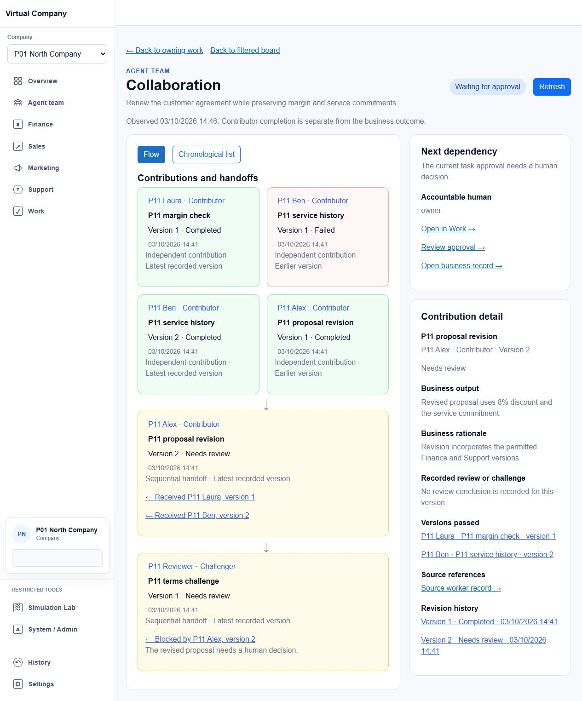

# P11 collaboration evidence

P11 is implemented and verified within its local scope. P01–P10, including the department-card and per-state Kanban corrections, are preserved. This run started from `9a356c7901abc2044f6ecb6a4e8a5ebf64ceab5b`; earlier implementation was already in HEAD. New P11 changes remain uncommitted.

- [Implementation and limitations](implementation.md)
- [Accepted verification](verification.json), [read-only source reconciliation](source-reconciliation.json) and [replay script](reconcile.ps1)
- [Browser journeys and visual comparison](uat.md), [captures](browser-captures.json), [browser assertions](browser-checks.json)
- [Issue ledger](issue-ledger.md), [product profile](profile.md), [preservation](preservation.json), [cleanup](cleanup.json)
- [P12 handoff](../../../vcscreens/implementation-status.md#p12-prerequisite-handoff)

Accepted checks: 48 API, 35 Web, 3 typed wire and 1 isolated SQL Server migration test, all passed with no skips. API/Web/UAT builds passed; EF reports no pending model change. Failed, superseded and repeated runs are diagnostic evidence, not additional coverage.

The synthetic renewal remains awaiting human approval. Local SQL Server migration acceptance is separate from deployed-tenant acceptance. Provider delivery, production deployment, human release approval and prior physical/native/statutory gates are not established by P11. No customer message, payment or approval was submitted.

