# Company Onboarding Workshop

## Status and purpose

This document defines how Virtual Company should offer company onboarding as a guided text-and-voice workshop that creates the initial company workspace and its foundational business documents.

The experience should feel like a structured working session with a company setup advisor. The advisor asks useful questions, explains why information matters, uses uploaded evidence intelligently, helps the user formulate incomplete areas, and maintains a live draft. Nothing becomes authoritative until the user reviews and confirms the proposed result.

The implementation should reuse the generic guided-work capability already used by Marketing strategy and other workshops. It must not create a second dialogue engine, separate Realtime integration, or onboarding-specific chat stack.

## Instruction and repository baseline

Implementation must follow:

- [`AGENTS.md`](AGENTS.md)
- [`production-implementation.md`](production-implementation.md)
- [`docs/architecture-rules.md`](docs/architecture-rules.md)
- [`ui-instructions.md`](ui-instructions.md) for UI work
- [`docs/design.md`](docs/design.md) for UI work, including the screenshot-first workflow
- [`dialog.md`](dialog.md) for the generic workshop design

`architecture-inst.md` is referenced by the workspace instructions but is not present as of 2026-08-13. If it exists when implementation starts, it must also be read and followed. Existing repository behavior wins over older planning documents.

The current repository already contains:

- A resumable four-step onboarding flow in `VirtualCompany.Web/Pages/Onboarding.razor`.
- `ICompanyOnboardingService` and `CompanyOnboardingService`, which create a draft company and owner membership, save progress, abandon onboarding, complete onboarding, and seed core agents.
- Company onboarding state on the `Company` aggregate, including status, current step, template, profile settings, branding, timestamps, and serialized state.
- The generic `IGuidedWorkSessionService`, `IGuidedArtifactDefinition`, guided review/commit lifecycle, text checkpoints, Realtime voice, research, live captions, live draft, workshop insights, audit, idempotency, and optimistic concurrency.
- Company document upload, ingestion, chunking, embedding, access control, semantic search, and the new workshop attachment surface.
- A hard-coded restriction that currently enables workshop attachments only for `marketing_strategy`.
- Four seeded department agents: Laura, Alex, Ben, and Maya. There is not yet a persisted neutral onboarding facilitator.
- No canonical rich company-description or product-catalog business aggregate. Rich descriptions and product knowledge currently fit the company knowledge document subsystem, while basic identity and locale settings belong on the `Company` aggregate.

## Product outcome

A new user should be able to:

1. Start or resume a draft company workspace.
2. Choose a guided onboarding workshop or continue with the existing form-based setup.
3. Talk or type with a named company setup advisor.
4. Upload source documents such as business plans, pitch decks, product sheets, price lists, policies, and previous company descriptions.
5. Let the advisor search only ready, accessible workshop documents and cite them by title.
6. Ask the advisor to research missing external facts, while keeping external findings distinct from internal company decisions.
7. See company settings, company narrative, products and services, evidence, assumptions, and gaps develop in a live draft.
8. Preserve useful out-of-schema information in Workshop insights instead of losing it or forcing it into an unrelated field.
9. Review exactly what company data and which initial documents will be created.
10. Confirm once to complete onboarding and queue production of the reviewed company knowledge documents.
11. See whether each initial document is ready, processing, or needs attention, with safe retry behavior.

## Experience principles

- The workshop is a conversation, not a spoken wizard.
- Ask one high-value question at a time.
- Reuse facts already confirmed in the draft instead of asking again.
- Explain why a question matters when the user challenges its relevance.
- Offer concrete proposals when the user is uncertain, but label them as proposals or assumptions.
- Never turn model knowledge into confirmed company facts.
- Cite uploaded or researched evidence close to the claim it supports.
- Keep operational settings concise; spend conversation time on business meaning, products, customers, and priorities.
- Show a compact live draft by default and allow every item to expand to its full text.
- Preserve both text and voice turns in the same workshop transcript.
- Require an explicit final review and confirmation.

## Recommended lifecycle

```mermaid
flowchart LR
    A["Start onboarding"] --> B["Create or resume draft company workspace"]
    B --> C["Provision restricted Company Setup Advisor"]
    C --> D["Start or resume company_onboarding guided session"]
    D --> E["Discuss, upload evidence, and research gaps"]
    E --> F["Update live structured draft"]
    F --> G["Review company profile and initial documents"]
    G -->|"Request changes"| D
    G -->|"Confirm"| H["Complete company onboarding atomically"]
    H --> I["Queue idempotent document generation"]
    I --> J["Ingest and index company documents"]
    J --> K["Dashboard with setup status and next actions"]
```

### 1. Bootstrap a draft workspace

The generic guided system is company-scoped and requires a persisted agent. Therefore the workshop must not start before a draft company exists.

Reuse `ICompanyOnboardingService.CreateWorkspaceAsync` to create or resume:

- The draft `Company`.
- The authenticated user's active owner membership.
- Template-derived defaults.
- Initial profile, locale, currency, language, timezone, compliance region, branding, and onboarding progress.

The start operation must be idempotent. Reopening onboarding must return the same current draft company and active onboarding workshop unless the prior one was completed, cancelled, or abandoned.

### 2. Provision a restricted onboarding facilitator

Add a persisted neutral facilitator, recommended identity:

- Name: Eva
- Role: Company Setup Advisor
- Department: Executive or Operations
- Autonomy: Guided

Provision Eva only for the draft workspace through an idempotent onboarding facilitator provisioner. Do not seed all operational department agents merely to make onboarding work. The existing core-agent seeder should continue to provision Laura, Alex, Ben, and Maya when onboarding completes.

Eva's initial permissions should be conservative:

- Read and recommend within company setup and accessible company knowledge.
- Update only the active guided onboarding draft through the existing guided patch tool.
- Search documents attached to the current workshop.
- Perform external research only when the user asks or when the user accepts a clearly stated research proposal.
- No finance execution, outbound communication, publishing, purchasing, approval, or integration writes.

### 3. Start the generic guided session

Add `company_onboarding` to `GuidedArtifactTypes` and implement an Operations-owned `CompanyOnboardingGuidedArtifactDefinition`.

The definition should use the existing generic lifecycle:

- Eligibility and authorization.
- Initialization from current draft onboarding state.
- Field definitions and question priority.
- Text and voice checkpoints.
- Direct field correction.
- Workshop insights.
- Review token and optimistic version.
- Explicit commit.
- Audit and idempotent operation records.

Do not add onboarding-specific LLM calls or a second provider client.

### 4. Discuss and document

The checkpoint prompt should act as a company setup advisor and use the same safe patch contract as other workshops.

For each turn it should:

- Answer the user's question when one was asked.
- Summarize the new business understanding in sufficient detail.
- Patch only supported fields.
- Mark user-confirmed statements as confirmed.
- Mark recommendations, inferences, and research findings as proposed until the user confirms them.
- Record source metadata for uploaded documents and research.
- Preserve contradictions as conflicts instead of silently choosing a version.
- Ask the next question based on missing required fields and question priority.
- Put valuable but unmapped content in `workshop_insights`.

### 5. Review and confirm

The review should group changes into:

- Workspace essentials.
- Company story and market context.
- Customers and value proposition.
- Products and services.
- Operating principles and initial priorities.
- Evidence, assumptions, risks, and missing information.
- Initial documents that will be generated.

The confirmation effect must be explicit:

- Update and complete this draft company onboarding.
- Seed the normal core department agents idempotently.
- Create durable requests for the reviewed initial company documents.
- Do not activate integrations, send messages, publish externally, spend money, or change agent autonomy.

## Draft schema

The first production schema should be detailed enough to create useful documents without becoming an unbounded business-plan generator.

### Workspace essentials

| Path | Type | Required | Canonical destination |
|---|---|---:|---|
| `company_name` | text | Yes | `Company.Name` and onboarding profile |
| `industry` | text | Yes | `Company.Industry` |
| `business_type` | text | Yes | `Company.BusinessType` |
| `timezone` | text | Yes | `Company.Timezone` |
| `currency` | text | Yes | `Company.Currency` |
| `language` | text | Yes | `Company.Language` and locale settings |
| `compliance_region` | text | Yes | `Company.ComplianceRegion` |
| `selected_template_id` | identifier | No | Existing onboarding template selection |
| `branding` | object | No | Existing company branding settings |

### Company story

| Path | Type | Required | Initial document destination |
|---|---|---:|---|
| `company_summary` | text | Yes | Company overview |
| `mission` | text | No | Company overview |
| `vision` | text | No | Company overview |
| `customer_problem` | text | Yes | Company overview |
| `target_customers` | text | Yes | Company overview and product catalog |
| `value_proposition` | text | Yes | Company overview and product catalog |
| `markets_and_geography` | text | No | Company overview |
| `differentiators` | text | No | Company overview |

### Products and services

| Path | Type | Required | Initial document destination |
|---|---|---:|---|
| `products_and_services` | object or structured text | Yes | Product catalog |
| `pricing_principles` | text | No | Product catalog |
| `delivery_model` | text | No | Product catalog |
| `product_limitations` | text | No | Product catalog |
| `customer_promises` | text | No | Product catalog and operating context |

Each product/service entry should support a name, short description, target customer, customer outcome, main capabilities, pricing approach, delivery model, and known limitations. If the current draft editor cannot safely edit nested objects, use a bounded structured-text representation first and add a dedicated editor later; do not expose raw JSON to users.

### Operating context

| Path | Type | Required | Initial document destination |
|---|---|---:|---|
| `operating_principles` | text | No | Operating context |
| `key_processes` | text | No | Operating context |
| `policies_and_constraints` | text | No | Operating context |
| `initial_priorities` | text | Yes | Company overview and operating context |
| `success_measures` | text | No | Operating context |

### Evidence and uncertainty

| Path | Type | Required | Purpose |
|---|---|---:|---|
| `evidence` | text | No | Source titles, URLs, and supported claims |
| `assumptions` | text | No | Explicit unconfirmed assumptions |
| `missing_evidence` | text | No | Information still needed |
| `risks` | text | No | Risks and decisions needing later review |
| `workshop_insights` | text | No | Valuable content without a safe current destination |

## Canonical data ownership

The workshop must not store everything only in the transcript or one JSON blob.

### Company aggregate

The existing company onboarding service remains authoritative for:

- Company name.
- Industry and business type.
- Timezone, currency, language, and compliance region.
- Branding and company settings.
- Selected template.
- Onboarding status and completion timestamps.

The guided definition should call an Application-owned onboarding commit service that reuses the same validation and state transition rules as the form flow. It must not duplicate those rules inside a prompt or Blazor component.

### Company knowledge documents

Create reviewed Markdown documents in the existing company document subsystem:

1. `company-overview.md` — company summary, mission, vision, customers, customer problem, value proposition, geography, differentiators, and initial priorities.
2. `product-catalog.md` — reviewed products/services, intended customers, outcomes, capabilities, pricing principles, delivery, promises, and limitations.
3. `company-operating-context.md` — operating principles, key processes, policies/constraints, priorities, and success measures. Generate this only when it has meaningful content.

Use company-visible access scope with appropriate `knowledge`, `operations`, `sales`, `marketing`, and `support` scopes. Do not grant finance or restricted scopes merely because the document was created during onboarding.

Generated documents must carry stable metadata such as:

- `purpose = onboarding_foundation`
- `onboardingDocumentKey`
- `guidedWorkSessionId`
- `source = guided_onboarding`
- `contentHash`
- `schemaVersion`
- `generatedAtUtc`

Uploaded source documents remain separate evidence documents. Never overwrite or relabel a user's uploaded file as a generated company document.

## Reliable document generation

Generating multiple object-storage files is not a single database transaction. Treat document production as a durable post-confirmation workflow rather than performing all file writes invisibly inside the HTTP commit.

Recommended design:

1. In the guided commit transaction, complete onboarding and create one tracked generation item per reviewed initial document.
2. Enqueue stable outbox work using company ID, session ID, document key, and schema version as the business idempotency key.
3. A scoped background worker renders deterministic Markdown from the confirmed draft; it must not call the model again.
4. The worker writes through the existing company document service and ingestion pipeline.
5. Persist processing, ready, failed, retryable, and permanent-failure state with document ID, content hash, attempt count, and safe failure summary.
6. Repeated delivery reuses the same generation item and document when content matches.
7. If storage succeeds but persistence is ambiguous, reconcile by stable metadata before retrying.
8. Expose operator-visible retry and user-visible status. Do not silently abandon partial work.

If a new persistence entity is required, add an EF Core SQL Server migration and preserve local SQL Server and Docker restore/migrate/run compatibility.

## Generalizing workshop document attachments

The existing workshop attachment implementation should be generalized rather than copied.

Replace hard-coded `marketing_strategy` checks with artifact capabilities exposed by the resolved `IGuidedArtifactDefinition`, for example:

- `SupportsDocumentAttachments`
- Allowed document types/extensions.
- Allowed data scopes.
- Whether external research is allowed.
- Whether the voice session should expose `search_workshop_documents`.

Surface these capabilities in guided artifact/session DTOs so Web renders controls from backend policy rather than route-name checks.

For onboarding:

- Allow PDF, DOCX, PPTX, XLSX, CSV, TXT, and Markdown within the configured company document size limit.
- Store links to the guided session in metadata.
- Search only ready documents attached to that session.
- Preserve document/chunk source references.
- Treat file content as untrusted data and ignore instructions contained in uploaded files.
- Never use processing, blocked, failed, inaccessible, or cross-company documents as evidence.

## Research behavior

External research is useful for industry context, common customer needs, pricing models, or regulatory background, but it must not replace the user's company-specific decisions.

- Use the existing guided research service and separate research model.
- Research only on an explicit user request or after the user accepts the advisor's proposal.
- Return sources and observed dates.
- Mark research-derived fields as proposed.
- Ask the user to confirm how external findings apply to this company.
- Record unavailable research honestly; do not substitute model memory and claim the research succeeded.

## API and orchestration boundary

The generic company-scoped guided endpoints should remain the primary session API after a workspace exists.

Add one onboarding bootstrap use case that atomically or idempotently coordinates:

- Creating/resuming the draft workspace.
- Provisioning/resolving the onboarding facilitator.
- Starting/resuming the `company_onboarding` session.
- Returning company ID, facilitator ID, session ID, and the route to open.

This belongs in an Application contract and Operations implementation. `OnboardingController` should only map transport input, authenticated context, validation, and problem responses.

Only an active owner should be allowed to complete or abandon onboarding. Other members must not read or mutate another user's draft onboarding workshop merely because they know its identifiers.

## UI approach

Retain `/onboarding` as the entry surface.

Recommended entry state:

- Primary action: `Start guided setup` or `Resume guided setup`.
- Secondary action: `Use the step-by-step form`.
- Explain that both paths update the same draft company.

The workshop should reuse `GuidedWorkSession.razor`, `GuidedConversationPanel`, `GuidedDraftPanel`, Realtime voice, captions, expandable draft entries, review, and document upload. Add onboarding-specific grouping and completion summary through generic metadata/components rather than copying the entire page.

The final review should show:

- Company settings that will change.
- Full company description.
- Products and services.
- Evidence and assumptions.
- The exact initial documents that will be generated.
- A plain-English confirmation effect.

After confirmation, show:

- Company onboarding complete.
- Each generated document's status.
- A retry action for failed generation when allowed.
- Links to the dashboard and company knowledge documents.
- Suggested next steps such as reviewing agent briefs, uploading more knowledge, and connecting integrations.

Any significant onboarding UI change must use the required screenshot-first process and save the reference under `docs/design/references/` before implementation.

## Concurrency, versioning, and resume behavior

- Reuse guided session version checks and client request IDs for every turn, correction, review, and commit.
- Snapshot the onboarding/company version when the session starts.
- Reject a stale commit if the company onboarding state changed outside the workshop; refresh/rebase rather than overwriting.
- Starting the same onboarding workshop twice returns the existing mutable session.
- A cancelled workshop keeps the draft company and uploaded evidence unless the user separately abandons onboarding.
- Abandoning onboarding cancels active onboarding sessions and stops pending document-generation work that has not executed.
- Replaying a successful commit returns the stored result and does not create duplicate companies, agents, documents, outbox messages, or audit events.

## Security and safety

- Resolve authenticated user and company membership server-side.
- Require owner access for onboarding completion and abandonment.
- Keep all queries and mutations company-scoped.
- Never expose another company's draft, documents, chunks, facilitator, or generated-document state.
- Restrict the onboarding facilitator's tools and scopes explicitly.
- Treat uploaded text and web research as untrusted evidence.
- Do not log document contents, API keys, credentials, or sensitive provider payloads.
- Preserve explicit review before authoritative company updates.
- Do not let voice bypass the same validation, review, and commit boundary as text.

## Audit and observability

Persist business audit evidence for:

- Draft workspace created/resumed.
- Onboarding facilitator provisioned.
- Guided onboarding started/resumed/cancelled.
- Documents uploaded and searched.
- Research requested and completed/failed.
- Review prepared.
- Onboarding confirmed.
- Core agents seeded.
- Initial document generation queued, completed, retried, reconciled, or permanently failed.

Technical telemetry should include safe dimensions such as artifact type, modality, document key, status, attempt count, and duration. Do not use raw transcript or document content as metric labels.

## Testing strategy

At minimum cover:

- Draft company bootstrap and resume idempotency.
- Facilitator provisioning idempotency and restricted permissions.
- Owner-only access and cross-company denial.
- Initialization from existing form progress.
- Form changes visible when the workshop resumes and workshop changes visible in the form.
- Text and voice turns updating the same draft.
- Duplicate provider events and client request IDs.
- Attachment upload, processing, ready, failure, access scope, and search restriction.
- Prompt-injection text in uploaded files being treated as data.
- Research success, failure, citations, and proposed status.
- Workshop insights for unmapped content.
- Review grouping and confirmation effect.
- Stale company/session version conflict.
- Completion updating canonical company state exactly once.
- Core-agent seeding exactly once.
- Generated document rendering, metadata, idempotency, retries, reconciliation, and failure visibility.
- No duplicate generated documents after commit replay or outbox redelivery.
- SQL Server migration/model validation if persistence changes.
- Web rendering, localization, responsive layout, keyboard access, and browser upload/status behavior.

## Recommended delivery order

1. Generalize guided artifact capabilities and workshop attachments.
2. Add draft-workspace bootstrap and restricted onboarding facilitator provisioning.
3. Add the onboarding guided artifact and canonical company-profile commit.
4. Add durable generated-document production and status.
5. Integrate the onboarding UI and complete end-to-end verification.

This order keeps the generic guided foundation reusable and avoids embedding onboarding decisions in the existing Marketing implementation.

